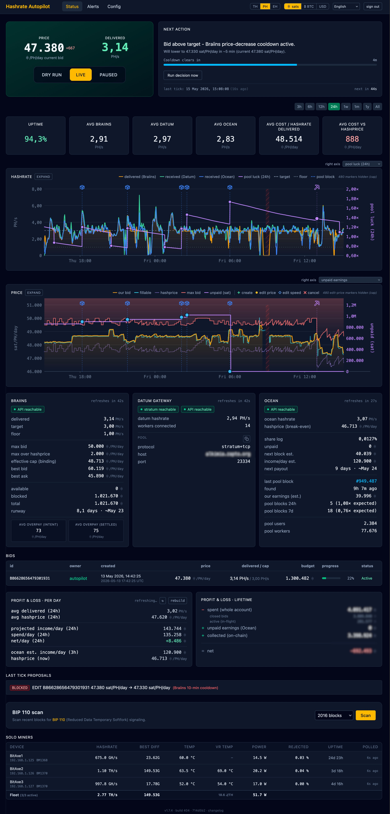
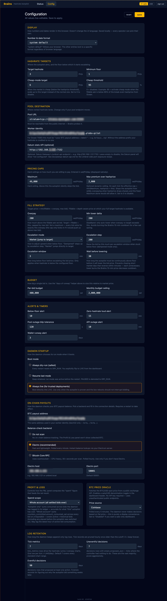

# Hashrate Autopilot

A personal-scale autopilot and monitor for the [Braiins Hashpower marketplace](https://hashpower.braiins.com/).
Keeps a rented-hashrate bid continuously alive at an operator-chosen price ceiling, so purchased hashrate keeps
landing at your own Datum-connected pool without manual babysitting.



The Status page is a single scroll: a hero card with the **effective rate** (the window-averaged price
actually paid, derived from the per-tick delta of Braiins's `amount_consumed_sat` counter divided by
delivered hashrate × elapsed time — this is an average over the selected chart range, not the live bid;
hover the number for a tooltip that says so) and its delta versus hashprice, the delivered-hashrate number,
and the DRY-RUN / LIVE / PAUSED switch on the left; the Next Action panel on the right explaining what the
autopilot is about to do and when. Below that sit range-selectable hashrate and price charts overlayed with
bid events and block markers. The price chart draws your bid (amber), the fillable ask the controller
tracks (cyan), hashprice (violet), and the safety ceiling (pink); the per-tick effective rate is a separate
emerald line, off by default behind a config toggle because it's dramatically more volatile than the
tracking lines and hijacks the Y-axis when enabled. Then a stats strip (uptime, avg hashrate per source —
Braiins / Datum / Ocean side-by-side, cost per PH delivered, effective rate vs hashprice), service panels
for Braiins / Datum Gateway / Ocean, the active bids table, and per-day and lifetime P&L measured from
actual account-ledger spend and on-chain receipts.

## Why this exists

The Braiins Hashpower marketplace works well, but bids cancel when the wallet drains, prices drift above
your bid, and fills stop the moment a bid sits below the level at which enough supply is available. The
common failure mode for a home miner is: wake up and discover that the order cancelled hours ago and
you've been sitting at zero hashrate since. This project replaces that with a controller that quietly
holds a bid alive at a price the operator is comfortable with, adjusted tick-to-tick to stay just above
the cheapest fillable ask without chasing orderbook noise.

The goal is **bounded, observable downtime** with an explicit recovery policy, not gapless uptime.

## How Braiins matches (the premise this tool is built on)

Braiins matches **pay-your-bid**: the bid price on your order is the price you pay per delivered EH·day
(not the clearing price of the cheapest ask). Lowering your bid by 100 sat/PH/day lowers the sat amount
Braiins deducts per delivered EH·day by the same 100 — regardless of where the cheapest fillable ask sits.

This was verified directly on a live bid on 2026-04-23 (A/B: 50,000 → 49,000 sat/PH/day max_bid drop →
effective cost 50,300 → 49,899 sat/PH/day, with the orderbook's fillable ask unchanged at ~47,158). An
earlier version of this project assumed classic CLOB / pay-at-ask semantics and parked the bid at the
max-bid ceiling; the A/B showed that left money on the table every tick. See `CHANGELOG.md` entry #53 and
`docs/spec.md` §8 for the full history.

Because the bid *is* the cost, the controller tracks the cheapest price at which the orderbook has enough
supply to cover the operator's target (the "fillable ask") and sits just above it by a configurable
`overpay_sat_per_eh_day` cushion. The `max_bid_sat_per_eh_day` and `max_overpay_vs_hashprice_sat_per_eh_day`
knobs exist purely as safety ceilings — they clamp the bid if fillable + overpay ever reaches a price the
operator wants to opt out of.

## Scope

**v1 (current):** Braiins Hashpower marketplace only. Single operator. Single always-on host on a home LAN
alongside an Umbrel Bitcoin node running [Ocean](https://ocean.xyz/) with a Datum Gateway.

**v2 (aspirational):** Multi-market abstraction so additional hashrate marketplaces can be plugged in behind the
same controller and dashboard.

Non-goals (v1): SaaS / multi-user, cloud deployment, hands-free wallet funding, gapless uptime.

## How it works

- A Node daemon runs a periodic control loop (default 60 s): reads Braiins marketplace state, compares it against
  the operator's configured target and ceiling, and decides whether to create, edit, or cancel a single bid.
- Steady state is **one bid tracked at `fillable_ask + overpay_sat_per_eh_day`**, clamped to the safety ceiling
  `min(max_bid, hashprice + max_overpay_vs_hashprice)`. Braiins matches pay-your-bid (empirically verified
  2026-04-23 — lowering the bid directly lowered effective cost), so the bid price *is* the price paid: it pays
  to sit just above the cheapest fillable ask rather than at the ceiling. Braiins' own 10-minute price-decrease
  cooldown is the only pacing rule — no escalation ladder, no patience timers.
- **All three mutations (create / edit / cancel) are fully autonomous.** An owner-scope API token authorises
  `POST /spot/bid` and `PUT /spot/bid` directly — the 2FA prompt that appears in Braiins' web UI does *not* gate
  the API path. The autopilot therefore has a single mutation gate (DRY-RUN vs LIVE vs PAUSED) rather than a
  separate human-in-the-loop confirmation layer.
- A React dashboard binds to the LAN, shows current state, live decisions, charts, and operator overrides.
- State and tick metrics persist to SQLite and survive restarts. Boot mode is configurable: always dry-run
  (default), resume last mode, or always live. Old `tick_metrics` and uneventful `decisions` rows are pruned
  hourly per configurable retention windows.
- Each tick also polls the **Ocean pool API** (hashprice, pool stats, payout estimate, recent blocks) and — when
  a `datum_api_url` is configured — the **Datum Gateway's `/umbrel-api`** for a second hashrate reading measured
  at the gateway. Both integrations are informational; the control loop never depends on them being reachable.
- Optionally reads `bitcoind` or Electrs for on-chain payout observation (income tracking, runway calculation).

Full design: [`docs/spec.md`](docs/spec.md) · [`docs/architecture.md`](docs/architecture.md) ·
[`docs/research.md`](docs/research.md).

## Key features

- **Fillable-tracking bid** — each tick the bid is set to `min(fillable_ask + overpay_sat_per_eh_day,
  effective_cap)`, where `fillable_ask` is the cheapest price at which the orderbook has enough
  unmatched supply to cover `target_hashrate_ph`. `overpay_sat_per_eh_day` is the one knob that trades
  "stability against short upward market moves" for "closer to the cheapest fillable price" — default
  1,000 sat/PH/day. The controller skips the tick entirely if `fillable_ask` is null (orderbook
  empty / Braiins API down), rather than defaulting to the cap.
- **EDIT_PRICE deadband** — a bid isn't edited for small drift. Threshold is `max(tick_size,
  overpay_sat_per_eh_day / 5)`, which at the default 1,000 sat/PH/day overpay is a 200 sat/PH/day
  window. Keeps noise out of the mutation log and avoids burning Braiins' 10-minute price-decrease
  cooldown on moves the operator doesn't care about.
- **Two-layer safety ceiling** — a fixed `max_bid_sat_per_eh_day` plus an optional dynamic cap
  `max_overpay_vs_hashprice_sat_per_eh_day`. The effective ceiling is the lower of the two. If
  fillable + overpay would exceed the ceiling, the bid clamps down to it (and may not fill) — the
  ceiling is the opt-out price, not the normal bid.
- **Effective rate as a first-class metric** — the price actually paid is measured per-tick from the
  delta of Braiins' `primary_bid_consumed_sat` counter divided by delivered hashrate × elapsed time.
  Surfaced as the hero PRICE number (window-averaged over the selected chart range) and as a stats
  card ("avg cost / PH delivered"). An emerald per-tick effective line on the price chart is available
  via a Config toggle, off by default — its counter-settlement volatility would crush the flatter
  lines' detail.
- **Cheap-mode opportunistic scaling** — when the market price (best ask) drops below a configurable
  percentage of the break-even hashprice, the autopilot scales the target up to
  `cheap_target_hashrate_ph` to capture cheap capacity. Reverts when the market recovers. A
  `cheap_sustained_window_minutes` knob enables hysteresis: cheap-mode only engages when the rolling
  average over that window is below threshold, avoiding flap on single-tick spikes.
- **Ocean pool integration** — reads hashprice, pool earnings, time-to-payout, Ocean-credited hashrate, and
  recent pool blocks from the Ocean API. Hashprice is plotted historically on the price chart. Ocean-credited
  hashrate is a first-class line on the Hashrate chart alongside Braiins-delivered and Datum-received. Every
  TIDES-credited pool block appears on the hashrate chart as an isometric cube marker — **blue** for the common
  case (pool block credited via TIDES) and **gold** for the rare solo-lottery case where our own worker found
  the block. Clicking a cube opens it in your configured block explorer (mempool.space by default; blockstream /
  blockchair / your own local explorer are preset pills on the Config page). Tooltips show block height, reward /
  subsidy / fees, and an estimated our-share for the block based on the current share_log.
- **Datum Gateway integration (optional)** — when `datum_api_url` is configured, the daemon polls Datum's
  `/umbrel-api` each tick and records the gateway-measured hashrate alongside the Braiins-reported number. A
  sustained gap means Braiins is billing for hashrate the gateway never saw. See
  [`docs/setup-datum-api.md`](docs/setup-datum-api.md) — on Umbrel the API port is not exposed by default and
  needs a one-line compose edit plus a full OS reboot (tested and stable since 2026-04-19).
- **Measured P&L and runway** — spend is read from Braiins' account transaction ledger (settled cost, not
  modelled bid × delivered) and income from on-chain payouts observed via Electrs or bitcoind. Runway on the
  Braiins service card is days-of-balance at the current measured spend rate.
- **Dashboard** — hashrate and price charts with time-range picker (3h / 6h / 12h / 24h / 1w / 1m / 1y /
  all), bid event markers on the price chart (each dot corresponds to a CREATE / EDIT / CANCEL; click to
  pin a detail panel that lists the target-price inputs at that tick — fillable, overpay, hashprice,
  caps, effective cap, plus a JSON export button), block markers on the hashrate chart, per-series
  rolling-mean smoothing configurable per chart (hashrate smoothing per-source; price chart smooths only
  `our bid` and `effective` — fillable / hashprice / max bid stay raw), stats bar (uptime, three
  side-by-side avg-hashrate cards for Braiins / Datum / Ocean, cost metrics), service panels that include
  a runway forecast on the Braiins card, split P&L panels (period and lifetime), live bid table with full
  IDs, and a full config editor with live reload.
- **BTC/USD denomination toggle** — all prices and balances can be viewed in sats or USD using a live BTC price
  oracle (CoinGecko, Coinbase, Bitstamp, or Kraken).
- **Operator overrides** — pause/resume, switch between dry-run and live, or trigger an immediate decision tick
  from the dashboard.

## Configuration

Everything that influences the controller — hashrate targets, price ceilings, cheap-mode thresholds, per-bid
budget, boot mode, payout-source backend, retention windows, the optional Datum and Ocean endpoints — is
live-editable from the Config page. Values are validated against the same Zod schema the daemon uses at startup;
Save writes the new row and the next tick picks it up. No daemon restart needed for any value on this page.



Sections map directly to the spec: **Hashrate targets** (target, floor, cheap-mode scale-up target +
threshold + sustained-window minutes), **Pool destination** (pool URL, worker identity, Datum stats API
URL), **Pricing** (the fillable-tracking `overpay_sat_per_eh_day` cushion plus the two safety ceilings
`max_bid_sat_per_eh_day` and `max_overpay_vs_hashprice_sat_per_eh_day`), **Budget** (per-bid `amount_sat`;
set to 0 to use the full available wallet balance on each `CREATE_BID`, clamped to Braiins' 1 BTC per-bid
cap), **Daemon startup** (boot
mode — always dry-run / resume last / always live), **Block explorer** (template used by the block-marker cubes
and the Ocean panel's last-pool-block link), **On-chain payouts** (payout address + Electrs-or-bitcoind
backend), **Profit & Loss** spend scope, **BTC price oracle** (feeds the sat↔USD toggle), **Chart
smoothing** (rolling-mean window per-source on the hashrate chart plus the price-chart `our bid` /
`effective` smoothing; also the toggle that enables the effective-rate line itself), and **Log retention**
for the append-only `tick_metrics` and `decisions` tables.

For appliance / Docker setups every configurable field is also overridable via `BHA_*` environment
variables — priority is `env > db > defaults`, read once at boot and re-validated through the same
schema. See [docs/configuration.md](docs/configuration.md) for the full list.

## Tech stack

TypeScript monorepo (pnpm workspaces), Node 22+, React dashboard, SQLite (better-sqlite3). Secrets persist
in `data/state.db` via the first-run wizard by default; SOPS-encrypted file remains supported for power users.

```
packages/
├── braiins-client   # typed client for the Braiins Hashpower REST API
├── bitcoind-client  # minimal bitcoind RPC client for on-chain payout observation
├── daemon           # control loop, gate, ledger, HTTP API, persistence
├── dashboard        # React UI (LAN-only)
└── shared           # shared types and utilities
```

## Installation

The daemon needs a place to live (somewhere it can stay running 24/7), a Braiins account with an API
token, and a way for you to reach the dashboard from a browser. Beyond that, four install paths exist.
Pick whichever matches how the rest of your stack is run.

### Choose your path

| Path | Best when | Footprint |
|---|---|---|
| **A — Umbrel app store** | You already run Umbrel and want a one-click install. | App-store install. Pending Phase 2 of [#56](https://github.com/rdouma/hashrate-autopilot/issues/56) — see below. |
| **B — Docker on a Linux box** | You have a small always-on Linux machine (NUC, Mini PC, Raspberry Pi, VPS) and don't want to install a Node.js toolchain on it. | One container, one volume, one port. Recommended for a fresh box. |
| **C — Bare-metal Node install** | You want to run from source, hack on it, or already have Node 22 + pnpm 10 around. | A git checkout + `pnpm install` + `./scripts/start.sh`. Same wizard as Path B. |
| **D — Power-user CLI with SOPS** | You want secrets at rest in a `sops`-encrypted file (because that's how the rest of your ops is structured), not in `state.db`. | Adds `sops` + `age` to the bare-metal install; runs `pnpm run setup` instead of the web wizard. |

All four end up at the same dashboard on port **3010**. All four boot the daemon in **DRY-RUN** —
nothing trades real money until you flip the switch from the dashboard's Status page.

> The wizard's setup endpoints are intentionally unauthenticated (the dashboard password is one of the
> things you *create* there). On a public network, restrict access to port 3010 with a firewall,
> Tailscale, or Tor until you've finished the wizard. Appliance platforms like Umbrel handle this
> automatically — the dashboard is exposed only over Tor / LAN there.

### Path A — Umbrel app

The Umbrel packaging is tracked in [#56](https://github.com/rdouma/hashrate-autopilot/issues/56) (Phase 2). Once it's submitted to the official Umbrel app
store, install will be a single click. Until then, an interim Community App Store can be added by URL
— watch the project releases for a pointer when it lands.

The Docker image (Path B) is what the Umbrel packaging wraps, so any progress on the image is also
progress on the appliance flow.

### Path B — Docker on a Linux box

Recommended for the typical "I have a Mini PC / Raspberry Pi / VPS that just needs to run this thing"
case. Docker handles the Node + pnpm + native-binding-build dance for you, and updating to a new
version is a single `docker pull`.

#### B.1. Install Docker (Ubuntu)

If Docker isn't on the box yet, install it via the official Docker repository (the `apt`-shipped
`docker.io` is older and missing buildx-style features). On a fresh Ubuntu 22.04 / 24.04:

```bash
# Pre-reqs
sudo apt update
sudo apt install -y ca-certificates curl gnupg

# Add Docker's GPG key + repo
sudo install -m 0755 -d /etc/apt/keyrings
curl -fsSL https://download.docker.com/linux/ubuntu/gpg | sudo gpg --dearmor -o /etc/apt/keyrings/docker.gpg
sudo chmod a+r /etc/apt/keyrings/docker.gpg
echo "deb [arch=$(dpkg --print-architecture) signed-by=/etc/apt/keyrings/docker.gpg] \
    https://download.docker.com/linux/ubuntu $(. /etc/os-release; echo "$VERSION_CODENAME") stable" \
  | sudo tee /etc/apt/sources.list.d/docker.list > /dev/null

# Install
sudo apt update
sudo apt install -y docker-ce docker-ce-cli containerd.io docker-buildx-plugin docker-compose-plugin

# (Optional) let your normal user run docker without sudo
sudo usermod -aG docker "$USER"
# log out + back in (or `newgrp docker`) for the group change to take effect
```

Verify:

```bash
docker --version          # → Docker version 27.x or newer
docker run --rm hello-world
```

#### B.2. Run the autopilot

```bash
docker run -d \
  --name braiins-autopilot \
  -p 3010:3010 \
  -v braiins-autopilot-data:/app/data \
  --restart unless-stopped \
  ghcr.io/rdouma/hashrate-autopilot:latest
```

What that does:

- `-d` — runs detached.
- `-p 3010:3010` — exposes the dashboard on port 3010 of the host.
- `-v braiins-autopilot-data:/app/data` — creates a Docker-managed named volume that persists every
  operator-relevant file (config, secrets, tick history, owned-bid ledger). Surviving container
  recreation is the whole point.
- `--restart unless-stopped` — if the host reboots or the container crashes, Docker brings it back.
- `ghcr.io/rdouma/hashrate-autopilot:latest` — pulls the image from the GitHub Container Registry.
  Multi-arch (`linux/amd64` + `linux/arm64`) so the same line works on a Pi.

#### B.3. Open the wizard

In a browser on any machine on the same LAN:

```
http://<docker-host>:3010
```

You'll be auto-redirected to `/setup`. Walk through the three steps; on submit the daemon writes
everything into the volume, transitions to operational mode, and signs you in. See **First-run
wizard** below for the per-step detail.

If your Ubuntu host has `ufw` active, allow inbound 3010:

```bash
sudo ufw allow 3010/tcp
sudo ufw reload
```

#### B.4. Pre-seed config via env vars (optional)

To skip parts of the wizard (or skip it entirely if you provide the required secrets), pass `BHA_*`
env vars on `docker run`:

```bash
docker run -d \
  --name braiins-autopilot \
  -p 3010:3010 \
  -v braiins-autopilot-data:/app/data \
  -e BHA_BRAIINS_OWNER_TOKEN=… \
  -e BHA_DASHBOARD_PASSWORD=… \
  -e BHA_TARGET_HASHRATE_PH=3.0 \
  --restart unless-stopped \
  ghcr.io/rdouma/hashrate-autopilot:latest
```

Bitcoin Core RPC creds auto-detect from the standard `BITCOIN_RPC_*` env vars Umbrel injects when
an app declares a Bitcoin Core dependency — no override needed when running alongside Umbrel's
bitcoind. Full list of `BHA_*` overrides: [`docs/configuration.md`](docs/configuration.md).

#### B.5. Day-to-day

```bash
# Tail the logs (everything goes to stdout — no log files inside the container):
docker logs -f braiins-autopilot

# Status:
docker ps --filter name=braiins-autopilot

# Stop / start / restart:
docker stop braiins-autopilot
docker start braiins-autopilot
docker restart braiins-autopilot

# Update to a new release:
docker pull ghcr.io/rdouma/hashrate-autopilot:latest
docker stop braiins-autopilot && docker rm braiins-autopilot
# re-run the docker run command from B.2 — the named volume preserves your state
```

To pin to a specific version (recommended for production), replace `:latest` with `:vX.Y.Z`. See
the [releases page](https://github.com/rdouma/hashrate-autopilot/releases).

### Path C — Bare-metal Node install

For source hackers, anyone already running Node 22 + pnpm 10, and operators who want
`scripts/deploy.sh`-style git-pull updates rather than container pulls.

#### C.1. Install Node 22 + pnpm

On **Ubuntu / Debian** (tested on 22.04 + Raspberry Pi OS) the default apt `nodejs` is too old and
`pnpm` isn't packaged at all. Grab Node 22 from NodeSource, then use `corepack` to activate `pnpm`:

```bash
# Node 22 via NodeSource
curl -fsSL https://deb.nodesource.com/setup_22.x | sudo -E bash -
sudo apt install -y nodejs

# pnpm via corepack (no separate install needed)
sudo corepack enable
corepack prepare pnpm@latest --activate
```

Verify with `node -v` (≥ v22) and `pnpm -v` (≥ 10).

On **macOS** (Homebrew):

```bash
brew install node pnpm
```

#### C.2. Clone, build, run

```bash
git clone https://github.com/rdouma/hashrate-autopilot && cd hashrate-autopilot
pnpm install
pnpm build
./scripts/start.sh
```

`start.sh` backgrounds the daemon, writes its PID to `data/daemon.pid`, and appends stdout/stderr to
`data/logs/daemon.log`. Companion scripts: `scripts/stop.sh`, `scripts/restart.sh`,
`scripts/status.sh`, `scripts/logs.sh`. For a foreground run (debugging), use
`pnpm -w run daemon` from the repo root.

The dashboard is served on port 3010, bound to `0.0.0.0` — reachable from any LAN machine as
`http://<this-host>:3010` or `http://<lan-ip>:3010`.

#### C.3. Open the wizard

Same as Path B.3 — open the dashboard URL, get redirected to `/setup`, walk the three steps. See
**First-run wizard** below.

If your Ubuntu host has `ufw` active:

```bash
sudo ufw allow 3010/tcp
sudo ufw reload
```

To verify reachability from another LAN box:

```bash
nc -zv <host>.local 3010    # or the host's LAN IP
# → "succeeded" = port reachable; "timed out" / "refused" = firewall (or daemon not listening)
```

#### C.4. Day-to-day

```bash
./scripts/logs.sh        # tail data/logs/daemon.log
./scripts/status.sh      # is the daemon running?
./scripts/restart.sh     # bounce
./scripts/stop.sh        # stop
./scripts/deploy.sh      # one-shot update: git pull, build, test, restart
```

`deploy.sh` is safe to run while the daemon is live — the restart only happens after the build +
tests succeed, so a broken commit can't take your running autopilot down. Common patterns:

- **Manual update** after you see a new release: just run it.
- **Nightly cron** (fully hands-off): `0 4 * * * cd /path/to/hashrate-autopilot && ./scripts/deploy.sh >> ~/deploy.log 2>&1`

The script does a `git pull --ff-only`, so it only runs on a tracking branch (e.g. `main`). To pin
to a tagged release, manage the checkout manually:

```bash
git fetch --tags && git checkout v1.3.0
pnpm install && pnpm build && ./scripts/restart.sh
```

### Path D — Power-user CLI with SOPS

The default Path B/C flow (web wizard → secrets in `state.db`) is appliance-friendly and what most
users should pick. If you'd rather store secrets in a `sops`-encrypted file at rest — typical reasons:
your ops workflow is already standardised on `sops` + `age`, or you don't want secrets in the
SQLite file that your backups roll up — that path remains fully supported.

#### D.1. Install sops + age

On **Ubuntu / Debian**:

```bash
sudo apt install -y age

# sops isn't in apt. Releases are version-named; resolve the latest tag from
# GitHub's /latest redirect, then download the matching .deb. On arm64 (Pi)
# replace `amd64` with `arm64`.
SOPS_VER=$(curl -fsSL -o /dev/null -w '%{url_effective}' https://github.com/getsops/sops/releases/latest | sed 's|.*/||')
curl -fsSL "https://github.com/getsops/sops/releases/download/${SOPS_VER}/sops_${SOPS_VER#v}_amd64.deb" -o /tmp/sops.deb
sudo apt install -y /tmp/sops.deb
sops --version
```

On **macOS**:

```bash
brew install age sops
```

#### D.2. Run the CLI setup script

After cloning + installing dependencies (see Path C.1–C.2):

```bash
pnpm run setup
```

The legacy interactive CLI. Generates an `age` key at `~/.config/braiins-hashrate/age.key`, writes
a `.sops.yaml` policy, prompts for your tokens + core config, encrypts the secrets to
`.env.sops.yaml`, and bootstraps `data/state.db`. Refuses to overwrite an existing setup unless you
pass `--force`.

> Use `pnpm run setup`, not `pnpm setup`. The bare `pnpm setup` is a built-in pnpm command that
> configures pnpm's own shell environment — it silently shadows any `setup` script in
> `package.json`. `pnpm run setup` disambiguates and invokes the autopilot's CLI.

Then start the daemon as in Path C:

```bash
./scripts/start.sh
```

The web wizard is *not* triggered — the daemon finds the SOPS file + populated config row and boots
straight into operational mode.

#### D.3. Editing the SOPS file later

```bash
SOPS_AGE_KEY_FILE=~/.config/braiins-hashrate/age.key sops .env.sops.yaml
```

The explicit `SOPS_AGE_KEY_FILE` is only needed if your `age` key isn't at the default `sops`
location (`~/.config/sops/age/keys.txt`) — `pnpm run setup` writes the project's key to a separate
path on purpose so it doesn't collide with other `sops`-encrypted projects on the same host.

#### D.4. Migrating between hosts (SOPS path)

`.env.sops.yaml` is gitignored. Two options:

1. **Fresh setup on the new host**: clone, `pnpm install && pnpm build && pnpm run setup`. Independent
   `age` key + encrypted file per host.
2. **Copy the secret bundle**: `scp` both `~/.config/braiins-hashrate/age.key` *and* `.env.sops.yaml`
   from origin to target. `chmod 600` the age key after the copy.

## First-run wizard

On a fresh install (no secrets configured) the daemon enters **NEEDS_SETUP** mode and the dashboard
auto-redirects to `/setup`. Three steps:

1. **Access** — your Braiins owner token (from hashpower.braiins.com → API tokens), an optional
   read-only token, and a dashboard password. Eye-toggle on every secret field so you can verify
   pasted tokens.
2. **Mining** — target + minimum-floor hashrate, your Datum gateway / pool URL, the BTC payout
   address, the worker identity (`<btc-address>.<label>` — auto-derived from the address; the period
   is mandatory or Ocean TIDES won't credit your shares), and an optional payout-tracking backend
   (Bitcoin Core RPC or Electrs).
3. **Review** — sanity-check, submit.

On submit the daemon writes everything to `state.db` and transitions to operational mode in-place
(no process restart). The wizard polls until the daemon is back, then signs you in automatically and
drops you on the Status page.

Daemon boots in **DRY-RUN** by default — promote to LIVE from the dashboard when you've verified the
autopilot is doing what you expect.

## Editing secrets / running on a second host

Both behaviours are independent of which install path you picked.

**Editing secrets later:** the wizard persists everything (config + secrets) into `data/state.db`
(or `/app/data/state.db` in the Docker case). Two ways to rotate:

1. **Re-run the wizard:** stop the daemon, run
   `sqlite3 data/state.db 'DELETE FROM secrets;'` to force NEEDS_SETUP, restart, and the dashboard
   redirects to `/setup` with your existing config pre-filled.
2. **`BHA_*` env-var override:** set the env var (e.g. `BHA_BRAIINS_OWNER_TOKEN=…`) in the daemon's
   environment and it takes precedence over the DB value on every boot. On Docker, that's
   `docker run -e BHA_…`. See [`docs/configuration.md`](docs/configuration.md).

**Running on a second host (or migrating):** all operator-relevant state lives under `data/`
(bare-metal) or in the named volume (Docker). Either:

1. **Fresh setup on the new host**: install via the same path you used on the first host, re-run
   the wizard. Independent state per host.
2. **Copy `data/` (or the volume) over**: `scp -r data/` from origin to target (bare-metal), or
   `docker volume export … | docker volume import …` (Docker). Stop the daemon on both sides first;
   SQLite WAL files don't appreciate concurrent processes.

See [`docs/spec.md`](docs/spec.md) for the full design and [`docs/architecture.md`](docs/architecture.md)
for deployment details.

## Disclaimer

This is an independent, unofficial project. **Not affiliated with, endorsed by, or supported by Braiins Systems s.r.o.**
"Braiins" and "Braiins Hashpower" are trademarks of their respective owners and are used here only to identify the
marketplace this tool interacts with.

Using this software to automate real trades involves real money and real counterparties. You are responsible for your
own funds, your own API keys, and the legal status of hashrate trading in your jurisdiction.

## License

MIT — see [`LICENSE`](LICENSE).
