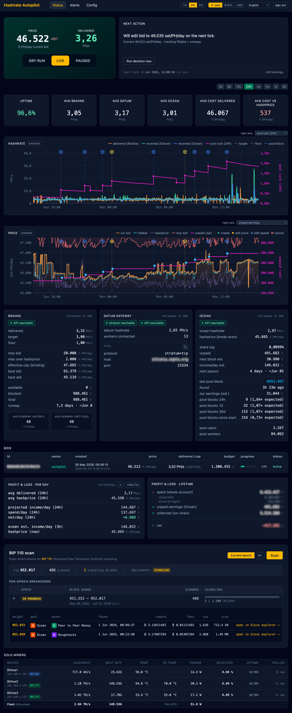
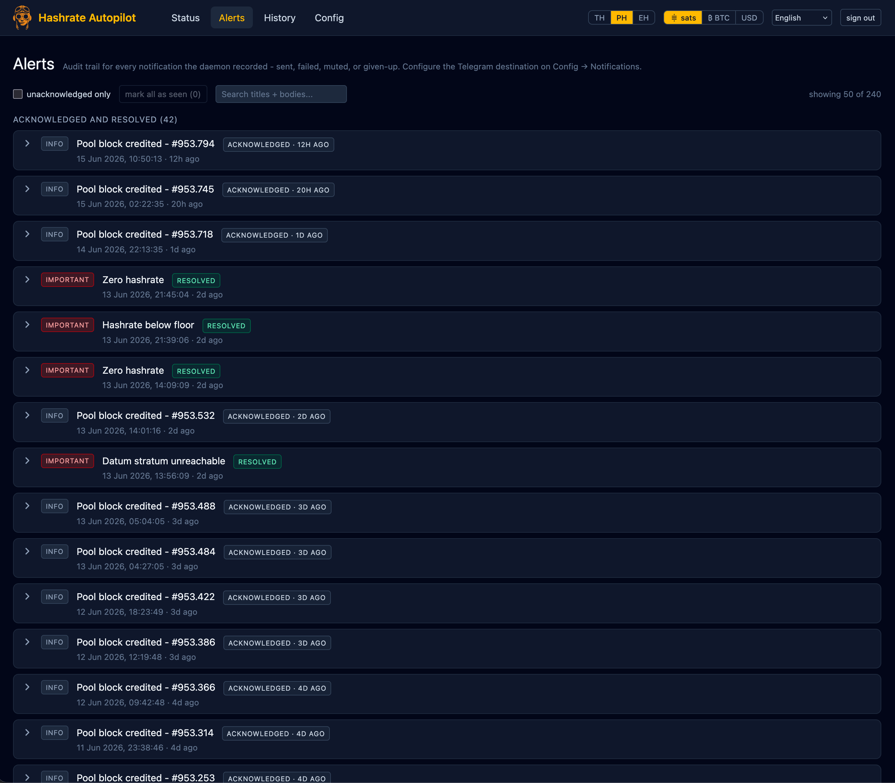
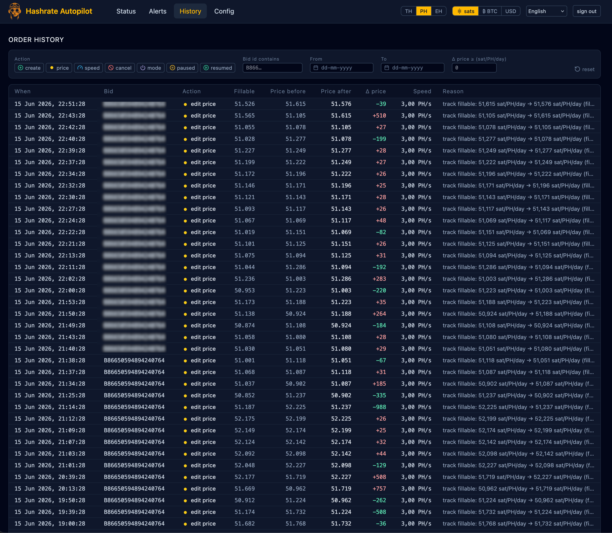
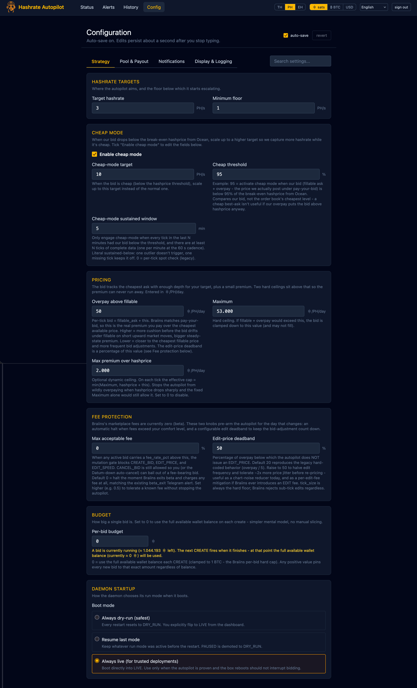
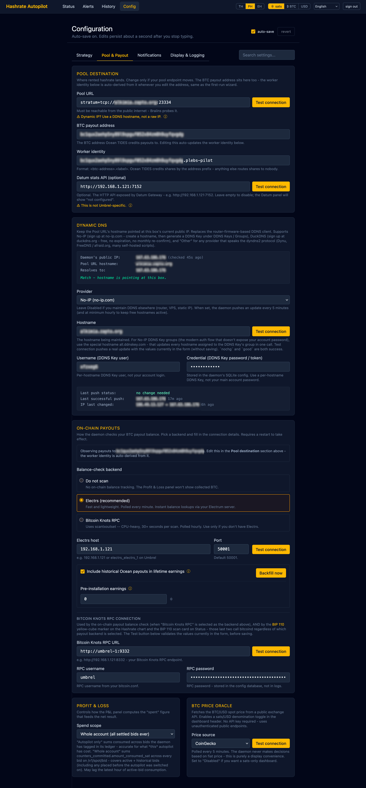
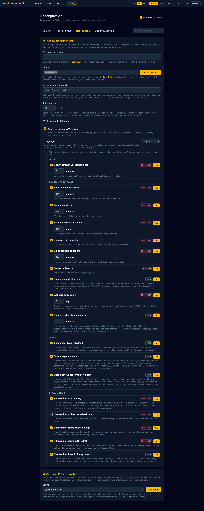
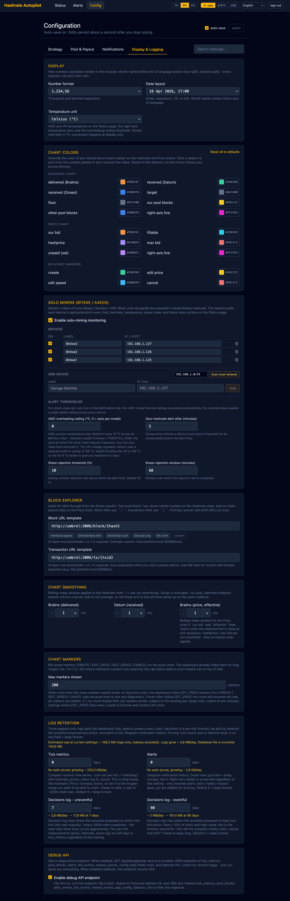

# Hashrate Autopilot

> 📦 **Already running the community-store version (`rdouma-hashrate-autopilot`) and switching to the official Umbrel App Store?** Don't just click Install — the official-store app id is different, so a straight install creates a second empty instance side-by-side with your existing data. Five-minute SSH-side migration recipe here: **[Migrating from the community store version](docs/migrating-from-community-store.md)**.

A personal-scale autopilot and monitor for the [Braiins Hashpower marketplace](https://hashpower.braiins.com/).
Keeps a rented-hashrate bid continuously alive at an operator-chosen price ceiling, so purchased hashrate keeps
landing at your own Datum-connected pool without manual babysitting.



The Status page is a single scroll: a hero card with the **live current bid** (the price Braiins charges
per delivered EH·day under pay-your-bid, so the bid *is* the truthful real-time number to anchor the
dashboard on) and its delta versus hashprice, the delivered-hashrate number, and the DRY-RUN / LIVE /
PAUSED switch on the left; the Next Action panel on the right explaining what the autopilot is about to
do and when. The window-averaged effective rate (derived per-tick from the delta of Braiins's
`amount_consumed_sat` counter divided by delivered hashrate × elapsed time) lives on the stats bar below
as **avg cost / PH delivered**, where the post-hoc range-averaged framing makes more sense. Below the
hero sit range-selectable hashrate and price charts overlayed with bid events, block markers,
difficulty-retarget pickaxe icons, on-chain payout gem markers, and public-IP-change router markers (so a
rejection-rate spike can be lined up against an ISP IP rotation). The price chart carries all four bid
events (create / edit price / edit speed / cancel); the hashrate chart additionally mirrors the speed-edit
(gauge) markers, since a speed-limit change is the one bid event that directly moves the delivered-hashrate
curve. The price chart draws your bid (amber), the fillable ask the
controller tracks (cyan), hashprice (violet), and the safety ceiling (pink); the per-tick effective rate is a separate emerald line, off by default
behind a config toggle because it's dramatically more volatile than the tracking lines and hijacks the
Y-axis when enabled. Then a stats strip (uptime, avg hashrate per source - Braiins / Datum / Ocean
side-by-side, cost per PH delivered, effective rate vs hashprice), service panels for Braiins / Datum
Gateway / Ocean, the active bids table, and per-day and lifetime P&L measured from actual account-ledger
spend and on-chain receipts. Every block on this page is draggable: hit **Rearrange** in the top bar, drag the
cards into the order you want (e.g. P&L up top, or the hashrate and price charts reordered independently), and
the layout is saved per-device in the browser so your phone and desktop each keep their own arrangement.

## Why this exists

The Braiins Hashpower marketplace works well, but bids cancel when the bid drains, prices drift above
your bid, and fills stop the moment a bid sits below the level at which enough supply is available. The
common failure mode for a home miner is: wake up and discover that the order cancelled hours ago and
you've been sitting at zero hashrate since. This project replaces that with a controller that quietly
holds a bid alive at a price the operator is comfortable with, adjusted tick-to-tick to stay just above
the cheapest fillable ask without chasing orderbook noise.

The goal is **bounded, observable downtime** with an explicit recovery policy, not gapless uptime.

## How Braiins matches (the premise this tool is built on)

Braiins matches **pay-your-bid**: the bid price on your order is the price you pay per delivered EH·day
(not the clearing price of the cheapest ask). Lowering your bid by 100 sat/PH/day lowers the sat amount
Braiins deducts per delivered EH·day by the same 100 - regardless of where the cheapest fillable ask sits.

This was verified directly on a live bid on 2026-04-23 (A/B: 50,000 → 49,000 sat/PH/day max_bid drop →
effective cost 50,300 → 49,899 sat/PH/day, with the orderbook's fillable ask unchanged at ~47,158). An
earlier version of this project assumed classic CLOB / pay-at-ask semantics and parked the bid at the
max-bid ceiling; the A/B showed that left money on the table every tick. See `CHANGELOG.md` entry #53 and
`docs/spec.md` §8 for the full history.

Because the bid *is* the cost, the controller tracks the cheapest price at which the orderbook has enough
supply to cover the operator's target (the "fillable ask") and sits just above it by a configurable
`overpay_sat_per_eh_day` cushion. The `max_bid_sat_per_eh_day` and `max_overpay_vs_hashprice_sat_per_eh_day`
knobs exist purely as safety ceilings - they clamp the bid if fillable + overpay ever reaches a price the
operator wants to opt out of.

## Scope

**v1 (current):** Braiins Hashpower marketplace only. Single operator. Single always-on host on a home LAN
alongside a Bitcoin node (Umbrel or otherwise) running [Datum Gateway](https://github.com/OCEAN-xyz/datum_gateway) 
pointed at [Ocean](https://ocean.xyz/).

**v2 (aspirational):** Multi-market abstraction so additional hashrate marketplaces can be plugged in behind the
same controller and dashboard.

Non-goals: SaaS / multi-user, cloud deployment, hands-free wallet funding, gapless uptime.

## How it works

- A Node daemon runs a periodic control loop (default 60 s): reads Braiins marketplace state, compares it against
  the operator's configured target and ceiling, and decides whether to create, edit, or cancel a single bid.
- Steady state is **one bid tracked at `fillable_ask + overpay_sat_per_eh_day`**, clamped to the safety ceiling
  `min(max_bid, hashprice + max_overpay_vs_hashprice)`. Braiins matches pay-your-bid (empirically verified
  2026-04-23 - lowering the bid directly lowered effective cost), so the bid price *is* the price paid: it pays
  to sit just above the cheapest fillable ask rather than at the ceiling. Braiins' own 10-minute price-decrease
  cooldown is the only pacing rule - no escalation ladder, no patience timers.
- **All three mutations (create / edit / cancel) are fully autonomous.** An owner-scope API token authorises
  `POST /spot/bid` and `PUT /spot/bid` directly - the 2FA prompt that appears in Braiins' web UI does *not* gate
  the API path. The autopilot therefore has a single mutation gate (DRY-RUN vs LIVE vs PAUSED) rather than a
  separate human-in-the-loop confirmation layer.
- A React dashboard binds to the LAN, shows current state, live decisions, charts, and operator overrides.
- State and tick metrics persist to SQLite and survive restarts. Boot mode is configurable: always dry-run
  (default), resume last mode, or always live. Old `tick_metrics` and uneventful `decisions` rows are pruned
  hourly per configurable retention windows.
- Each tick also polls the **Ocean pool API** (hashprice, pool stats, payout estimate, recent blocks) and - when
  a `datum_api_url` is configured - the **Datum Gateway's `/umbrel-api`** for a second hashrate reading measured
  at the gateway. Both integrations are informational; the control loop never depends on them being reachable.
- Optionally reads `bitcoind` or an Electrum server (electrs, Fulcrum, and ElectrumX all work) for on-chain payout
  observation (income tracking, runway calculation). On
  the Electrum path, lifetime earnings count **every coinbase tx ever credited to your payout address** - including
  historical Ocean payouts you've already swept to another wallet - so the P&L stays coherent even if you reuse a
  payout address across before-and-after-installation periods. A `Backfill now` button under Config -> Pool &
  Payout pulls historical receipts on demand. Operators with fresh-address discipline can disable the backfill via
  the same panel. There's also a `Pre-installation earnings` field for off-chain income the on-chain observer
  can't see (Lightning payouts, swept Ocean history) that gets folded into the lifetime chart and the net P&L.

Full design: [`docs/spec.md`](docs/spec.md) · [`docs/architecture.md`](docs/architecture.md) ·
[`docs/research.md`](docs/research.md).

## Key features

- **Fillable-tracking bid** - each tick the bid is set to `min(fillable_ask + overpay_sat_per_eh_day,
  effective_cap)`, where `fillable_ask` is the cheapest price at which the orderbook has enough
  unmatched supply to cover `target_hashrate_ph`. `overpay_sat_per_eh_day` is the one knob that trades
  "stability against short upward market moves" for "closer to the cheapest fillable price" - default
  1,000 sat/PH/day. The controller skips the tick entirely if `fillable_ask` is null (orderbook
  empty / Braiins API down), rather than defaulting to the cap.
- **EDIT_PRICE deadband (configurable)** - a bid isn't edited for small drift. Threshold is `max(tick_size,
  overpay_sat_per_eh_day × bid_edit_deadband_pct / 100)`. Default `bid_edit_deadband_pct = 20` reproduces
  the legacy hard-coded `overpay / 5`, so at the default 1,000 sat/PH/day overpay it stays a 200 sat/PH/day
  window. Raise to 50 to halve edit frequency and tolerate ~2x more jitter - useful as a chart-noise
  reducer today and as per-edit-fee mitigation if Braiins ever introduces an EDIT fee. `tick_size` remains
  the hard floor.
- **Fee protection** - operator-tunable ceiling `max_acceptable_fee_pct` (default 0). When any active bid's
  `fee_rate_pct` exceeds this, the mutation gate blocks CREATE / EDIT / EDIT_SPEED; CANCEL_BID stays
  allowed so the operator (or the Datum-down auto-cancel) can still bail out of a fee-bearing bid. Default
  0 halts on any non-zero fee_rate_pct, matching the existing `beta_exit` Telegram alert. The halt clears
  automatically the next tick all active bids drop back at-or-below the threshold; the threshold itself is
  the operator's acknowledgement. Raise to a known tolerated value if Braiins introduces a small fee you
  want to keep trading through.
- **Two-layer safety ceiling** - a fixed `max_bid_sat_per_eh_day` plus an optional dynamic cap
  `max_overpay_vs_hashprice_sat_per_eh_day`. The effective ceiling is the lower of the two. If
  fillable + overpay would exceed the ceiling, the bid clamps down to it (and may not fill) - the
  ceiling is the opt-out price, not the normal bid.
- **Effective rate as a first-class metric** - the price actually paid is measured per-tick from the
  delta of Braiins' `primary_bid_consumed_sat` counter divided by delivered hashrate × elapsed time.
  Surfaced as a stats card ("avg cost / PH delivered") and, optionally, as an emerald per-tick
  effective line on the price chart (Config toggle, off by default - its counter-settlement
  volatility would crush the flatter lines' detail). The hero PRICE card shows the **live current bid**
  instead of the effective rate, because under pay-your-bid Braiins charges the bid price exactly,
  so the bid is the truthful real-time number to anchor the dashboard on (the post-hoc range-averaged
  effective rate stays available on the stats card alongside).
- **Cheap-mode opportunistic scaling** - when our actual bid (fillable ask + overpay - the price we
  post under pay-your-bid) drops below a configurable percentage of the break-even hashprice, the
  autopilot scales the target up to `cheap_target_hashrate_ph` to capture cheap capacity. Reverts
  when our bid recovers above the threshold. Lives in its own Config → Strategy section with an
  explicit **Enable cheap mode** checkbox; the three knobs (scale-up target, threshold %,
  sustained-window minutes) grey out when the checkbox is off. The sustained-window knob gates
  engagement: cheap-mode only engages when every tick in the window had our bid below the threshold,
  so a single-tick price dip doesn't flap the target.
- **Ocean pool integration** - reads hashprice, pool earnings, time-to-payout, Ocean-credited hashrate, and
  recent pool blocks from the Ocean API. Hashprice is plotted historically on the price chart. Ocean-credited
  hashrate is a first-class line on the Hashrate chart alongside Braiins-delivered and Datum-received. An
  optional **`% of Ocean`** overlay (Config toggle, off by default) plots Ocean's `share_log` percentage as a
  violet line on a right-side Y-axis, so you can watch how your slice of the pool drifts over time as Ocean's
  total hashrate grows or your delivered PH/s fluctuates. Every TIDES-credited pool block appears on the
  hashrate chart as an isometric cube marker - **blue** for the common case (pool block credited via TIDES) and
  **gold** for the rare solo-lottery case where our own worker found the block. Clicking a cube opens it in
  your configured block explorer (mempool.guide by default - a BIP-110-aware mempool.space fork; mempool.kilombino.com
  (also BIP-110-aware) / mempool.space / blockstream / blockchair / btcscan / btc.com / your own local explorer are
  preset pills on the Config page). Tooltips show block height, reward / subsidy / fees, and an estimated
  our-share for the block based on the current share_log.
- **Datum Gateway integration (optional)** - when `datum_api_url` is configured, the daemon polls Datum's
  `/umbrel-api` each tick and records the gateway-measured hashrate alongside the Braiins-reported number. A
  sustained gap means Braiins is billing for hashrate the gateway never saw. Despite the name, `/umbrel-api`
  is a Datum Gateway endpoint, not an Umbrel one - it's compiled into the Datum binary when built with
  `DATUM_API_FOR_UMBREL` (the Umbrel image is built that way; the endpoint exists on the Datum side and
  Umbrel just consumes it for its app-card widget). The default port is 7152, which the Umbrel image
  rewires to container port 21000 - that's why the setup doc maps host `7152 → container 21000`. See
  [`docs/setup-datum-api.md`](docs/setup-datum-api.md) - on Umbrel the API port is not exposed by default and
  needs a one-line compose edit plus a full OS reboot (tested and stable since 2026-04-19).
- **Measured P&L and runway** - spend is read from Braiins' account transaction ledger (settled cost, not
  modelled bid × delivered) and income from on-chain payouts observed via your Electrum server or bitcoind. Runway on the
  Braiins service card is days-of-balance at the current measured spend rate.
- **Dashboard** - hashrate and price charts with drag-to-pan and click-to-focus scroll-wheel zoom
  (TradingView-style; click a chart to activate zoom, click outside or press Escape to deactivate; blue
  outline shows the focused chart), time-range presets (3h / 6h / 12h / 24h / 1w / 1m / 1y / all) that
  stay highlighted while panning and soft-snap during zoom, viewport-scoped Y-axis that only scales to
  visible data (out-of-view spikes don't compress the chart), **clickable legend** - tap any legend entry to
  hide that series and tap again to restore it (Chart.js / Bitaxe style); hiding a series also rescales the
  Y-axis to what's left, and the choice persists per device per chart, a "live" button that appears when panned
  away from the current edge, bid event
  markers on the price chart (each dot corresponds to a CREATE / EDIT / CANCEL; click to pin a detail panel
  that lists the target-price inputs at that tick - fillable, overpay, hashprice, caps, effective cap, plus
  a JSON export button), block markers and retarget pickaxes on both charts, per-series rolling-mean
  smoothing configurable per chart (hashrate smoothing per-source; price chart smooths only `our bid` and
  `effective` - fillable / hashprice / max bid stay raw), **offline-period reconstruction** - daemon-offline
  gaps render as a hatched band, and a boot-time backfill walks the gap inserting synthetic ticks every
  5 min plus one at each detected difficulty retarget so the pool-luck line step-changes through the gap
  and retarget markers land at (close to) canonical time even after long outages, **configurable stats bar** -
  the operator picks which tiles appear (#266); a catalogue of ~22 tiles covers uptime decomposition (bid coverage
  vs delivery while bidding), avg-hashrate cards (Braiins / Datum / Ocean), avg cost vs hashprice + overpay
  intent/settled, hashprice, pool blocks (30d), three pool-luck tiles (24h/7d/30d, window-aware emerald/amber/red
  bands), share log %, share rejection, wallet runway, hashrate target, and Bitaxe fleet tiles (hashrate always
  in TH/s, power in W, J/TH efficiency, best-difficulty record). Picker dropdown on each slot, drag-to-reorder
  inside the bar via hover-revealed grip handles, up to 24 tiles, persists daemon-side so the choice follows
  the operator across browsers. Defaults to the original six when empty so existing installs see no change.
  **Synced crosshair across both charts** - hovering either chart draws a vertical guide on both with a
  floating readout of every visible series at the snapped tick; click to pin; Esc or click outside dismisses;
  press-and-hold on touch then scrub.
  Service panels include a runway forecast AND a Braiins share-rejection ratio on the Braiins card (computed
  server-side from raw `tick_metrics` rows over the selected chart range; also available as a chart right-axis
  series so the operator can see when the ratio spiked - #243), split P&L panels (period and lifetime - "collected
  (on-chain)" reads lifetime received from `reward_events`, not current UTXO balance, so a payout that's
  been spent still counts; the lifetime panel also carries a dedicated **return on spend** row showing
  `net / spent` as a percentage so the operator can read the rate of return alongside the absolute net
  figure - #249), live bid table with full IDs, and a full config editor with live reload.
- **History page** - dedicated `/history` route (#256 v2) with a flat filterable table of every bid event
  (CREATE / EDIT_PRICE / EDIT_SPEED / CANCEL) the autopilot or operator emitted, replacing the older per-bid
  collapsible view. Filter chips with action glyphs, full bid ID, denomination-aware `|Δ price| ≥ N` filter
  (input units track the active TH/PH/EH toggle), locale-aware custom date picker, server-side infinite-scroll
  pagination. Columns: when, bid id, action, fillable-at-event, price before / after, Δ price (green
  down / red up), speed. SQL coalesces orphan-CREATE rows whose `braiins_order_id` lands a few ticks later,
  and carries speed / last-price forward so cells aren't blank for an order that demonstrably had values.
- **Unit toggles in the header** - hashrate displays as TH/s, PH/s, or EH/s and prices as sat, ₿ (BTC), or
  USD. Both pickers persist per browser. The USD path uses a live BTC oracle (CoinGecko, Coinbase, Bitstamp,
  or Kraken; pick one) refreshed daemon-side every 4 minutes so it stays current even when the dashboard tab
  is closed. Config -> Pool & Payout -> BTC price oracle has an inline **Test connection** button (#270)
  that probes the selected provider and reports the live BTC/USD price (or a concrete error - HTTP status,
  timeout, etc.) without saving. When the oracle is configured but transiently unreachable, the USD button
  in the header greys out with a tooltip explaining the cause rather than silently disappearing (#274).
- **Pool-luck plot** - the Hashrate chart's right-axis dropdown can render a pool-luck multiplier
  (`observed / Poisson-expected`) over a 24h, 7d, or 30d trailing window. Decays continuously between finds, jumps
  on each new pool block. The OCEAN panel shows the same number as a "X.XX× expected" annotation next to
  `pool blocks 24h / 7d / 30d` plus an all-time pool block count, so chart and panel always agree. Tooltips compute Ocean's live network-hashrate
  share and the implied expected block count for the current window. Difficulty retargets cause a
  discontinuous luck jump (higher difficulty = smaller pool share = fewer expected blocks = higher luck);
  retarget markers appear on the luck line with before/after luck values in the tooltip so the operator
  can see exactly how the retarget shifted the reading. When a pool block ages out of the trailing window, the step-down tooltip shows from/to luck values (matching the step-up format on new finds) so the operator sees both sides of the jump.
- **Chart marker shapes** - the icons on the Hashrate chart carry a precedence-ordered
  vocabulary so the rare events stand out. All markers use Lucide icons for visual consistency. **Own block** (Ocean credited the coinbase to your payout
  address - the lottery-win case) renders as a **gold crown**. **BIP 110-signalling pool block**
  (header version bit 4 set; Reduced Data Temporary Soft Fork) renders as a **yellow box**. **Default pool block**
  renders as a **blue box**. **Difficulty retargets** show a **violet pickaxe**. **Bitaxe miner best difficulty records** show a **gold trophy** with a dashed vertical line. Tooltip header label and colour follow the same precedence (own > BIP 110 >
  default). Detection happens daemon-side via your bitcoind RPC (`getblockheader`) or Electrum server
  (`blockchain.block.header`) - no third-party API. **Public-IP change markers** (sky router icons) appear at the top of the Hashrate chart whenever the daemon's IP poller (60 s cadence to `api.ipify.org`) observes a different public IP; the marker's styled tooltip shows the old → new IP pair and locale-formatted detection time, and the DDNS card on the Pool & Payout tab carries an "IP last changed" timestamp so rejection-rate spikes can be correlated against ISP rotation events. Each pool-luck step-marker tooltip carries a green `FOUND` or red `AGED OUT` badge per contributing block; multiple events landing in the same daemon tick (e.g. one block ages out while another lands) collapse into a single dot with both blocks' detail panels. A separate **BIP 110 scan card** on the Status page
  lets you scan signaling by difficulty epoch (toggle: `Current epoch` for the live MASF window, or `All` for everything since block 938,903 - the first known BIP 110 signaling block, found 2026-03-01). Per-epoch breakdown rows expand to show their signaling blocks inline (Pool / Miner column split - Ocean blocks surface both the pool wrapper and the inner template-author tag; non-Ocean blocks show the pool tag alone). Each row carries a MASF progress bar against the 55% threshold (`ceil(2016 × 0.55) = 1109` signaling blocks). The deployment-status badge has a lifecycle-aware tooltip naming both paths: miner-activated (MASF, 55% in any epoch locks in early) and user-activated (UASF, block height 965,664 enforced unconditionally regardless of signaling); when LOCKED_IN or ACTIVE the wording adapts. The forecasted UASF date is dynamic - `now + (965,664 − tip) × 600s`, matching every block-time calculator (currently early-September 2026 at typical block rate). Block markers and retarget icons are mirrored onto the price chart, so the operator sees these events in
  context on both charts. **Braiins deposit markers** (purple fuel-pump icons) appear on the Price chart whenever Braiins credits a deposit to your marketplace wallet. The marker is positioned at the Bitcoin transaction timestamp from the Braiins API. When the right-axis series is `total_balance_sat`, a purple dot appears on the balance line at the step-up caused by the deposit, with a dotted connector line back to the fuel icon so the operator can visually trace which deposit caused which balance jump. Hovering either the fuel icon or the dot opens the same tooltip with deposit amount, transaction ID, and timing. **On-chain payout gems** (emerald) appear at the top of the Price chart with a dashed vertical line whenever a payout is detected on-chain; clicking opens a tooltip with block height, date, amount, and a block-explorer deep-link. A purple dot on the unpaid-earnings line marks the earlier moment Ocean debited the balance (payout initiated), bridging the visual gap between the unpaid drop and the on-chain confirmation.
- **Telegram notifications** - three severity tiers across eighteen event classes. **IMPORTANT** (red, with a
  retry ladder and paired recovery messages): Datum stratum unreachable, hashrate below floor, zero
  hashrate, Braiins API unreachable, unknown bid detected, bid sustained-paused, wallet runway below
  threshold, and the Braiins-side compliance-returned deposit. **WARNING** (amber): Braiins beta-exit
  fees detected. **INFO** (slate, opt-in good news): pool block credited via TIDES (with a "+ ON-CHAIN PAYOUT" title suffix and payout amount when the block triggers a payout), Braiins deposit detected (mempool / first-confirmation), Braiins deposit available (compliance-cleared and spendable), marketplace empty (reachable but no supply; won't double-fire with the API-unreachable alert during outages), Bitaxe miner best difficulty (new all-time high share difficulty record).
  Each event class has its own opt-out toggle; timer-driven events carry an inline minute threshold so
  the operator can tune "how long bad before I get paged" per-event. Messages localise to the operator's
  chosen language (English / Dutch / Spanish, independent of the dashboard's display language). Setup
  walkthrough at [`docs/setup-telegram.md`](docs/setup-telegram.md). The notifier is structured around a
  `NotificationSink` interface so a future Nostr / ntfy / email backend can slot in without touching the
  event detectors. Audit trail at the dedicated `/alerts` page.
- **Bitaxe miner monitoring** - optional fleet monitor for home Bitaxe / Nerdaxe / ESP-Miner units
  (anything running AxeOS firmware) alongside the autopilot's rented Braiins hashrate. The integration is
  AxeOS-specific, not solo-mining-in-general; a Bitaxe can mine to a pool just as easily as solo. When
  enabled, the daemon polls each registered device's `/api/system/info` every tick (2 s per-device
  timeout, parallel poll so one unreachable unit doesn't block the rest). Per-device readings on the
  Status page: hashrate, ASIC + VR temperature, power draw, share-rejection ratio, best-ever-difficulty,
  uptime. Fleet footer aggregates total hashrate, total watts, J/TH efficiency, and active-device count.
  Five Telegram event classes (independently opt-out-able): four IMPORTANT - **overheating** (75 °C ASIC
  ceiling matching AxeOS firmware's THROTTLE_TEMP, with a global override; VR has a separate 100 °C
  ceiling), **zero hashrate / unreachable**, **share-rejection high** (rolling-window threshold), and
  **stratum URL drift** (firmware silently re-pointed at a different pool) - plus one INFO: **best
  difficulty** (new all-time high share difficulty record, rendered as a staircase line with trophy
  markers on the Hashrate chart). Device management lives in Config -> Display & Logging -> Bitaxe
  miners; a "Scan local network" button probes the daemon's /24 subnet (or a CIDR you type in the
  override field - required on Umbrel, where the daemon sits on the docker bridge subnet and not the host
  LAN) and returns AxeOS-shaped responders so adding a fleet doesn't require typing every IP. Master
  toggle defaults off and hides the Status card + alerts when disabled.
- **Block-found audible cue** - optional sound when Ocean credits your address with a new pool block. Five
  bundled cues (cowbell, glass-drop-and-roll, two metallic clanks, and an "Ocean mining found a block"
  voice clip) plus custom MP3 / OGG / WAV / WebM upload up to 200 KB. Plays once per new block; the
  dashboard tab needs to be open.
- **Per-chart right-axis dropdown** - render BTC/USD price, network difficulty, pool hashrate, Ocean unpaid
  balance, estimated block reward, pool-luck (24h/7d/30d), solo best difficulty, share_log, effective rate,
  paid earnings, lifetime earnings, or Braiins balance against the chart's primary series. Independent picker
  per chart, persists per browser.
- **Multilingual UI** - every page (Status, Config, Setup wizard, Login, charts, tooltips, time-relative
  strings, range selectors) translates between English, Dutch, and Spanish. Language picker sits in the
  header next to "sign out"; the choice persists to localStorage and the page boots in the operator's stored
  language (browser language as fallback). Units (`PH/s`, `sat/PH/day`, `BTC`) and proper nouns (Datum, Ocean,
  Braiins, Bitcoin Knots, Electrs, TIDES) deliberately stay English in every locale because that is how the
  Bitcoin community writes them. Czech is a likely next addition (Braiins / Trezor / Prague culture); other
  locales are easy to add - one entry in `SUPPORTED_LOCALES` plus a translation pass.
- **Operator overrides** - pause/resume, switch between dry-run and live, or trigger an immediate decision tick
  from the dashboard.

## Alerts

Every notification the daemon records - sent, failed, muted, given-up - lands in an append-only audit
trail at `/alerts`.



Events render as collapsible cards grouped into two sections: **OPEN** (firing, not yet seen) and
**Acknowledged and resolved** (one chronological bucket for both acked-not-recovered events and
recovery-paired events, sorted newest-first by firing time). The per-card right-side pill keeps the
state distinction visible per row: emerald `RESOLVED` vs slate `ACKNOWLEDGED · {age}`. Open cards
render expanded by default; the merged bucket collapses to a header. A free-text search box filters
across titles + bodies with hit-highlighting. Filter "unacknowledged only" is sticky across reloads,
"mark all as seen" clears the OPEN bucket with a single click. Each Telegram firing carries
an inline **Mark as seen** button; tapping it on your phone routes back through the bot's
`getUpdates` long-poll and updates the row server-side, so the dashboard badge clears even without
opening the page. The badge on the nav tab counts only unacknowledged IMPORTANT/WARNING firings;
INFO and recoveries don't bump it.

A bottom-right **toast** also appears in the dashboard the moment a new alert lands, severity-coloured
to match (red / amber / slate / emerald for resolved), with a 5 s auto-dismiss for INFO/recoveries and
15 s for the louder ones. Click to navigate to /alerts, or × to dismiss silently.

Telegram setup is a 60-second walkthrough at [`docs/setup-telegram.md`](docs/setup-telegram.md): chat to
@BotFather, paste the token, paste your numeric chat id from @userinfobot, click Test connection. If you
run more than one daemon against the same bot/chat, set an **Instance label** under Config →
Notifications and every message gets prefixed with `[<label>] ` so you can tell them apart at a glance.

## History

Every bid event the autopilot or operator emitted - CREATE / EDIT_PRICE / EDIT_SPEED / CANCEL - lands in
an append-only log surfaced at `/history` as a flat sortable table.



Toolbar filters: action-kind chips with Lucide glyphs matching the rows, full bid-id substring, From / To
date range via a custom locale-aware date picker (the browser-native `<input type=date>` always rendered
in the *browser's* locale rather than the dashboard's chosen language; the custom picker formats via
`Intl.DateTimeFormat` in the active locale and emits a local-midnight ms timestamp), and a denomination-aware
`|Δ price| ≥ N` filter whose input unit tracks the active TH / PH / EH toggle (converted to sat/EH/day on
the wire). Columns: When, Bid (full id, no truncation), Action, Fillable-at-event, Price before, Price
after, Δ price (green for downward, red for upward), Speed. Server-side infinite-scroll pagination via a
`before_id` cursor. SQL coalesces the bid id forward on CREATE_BID rows that land before Braiins echoes the
assigned id (1 h window) and carries the bid's speed and last-known price forward across events so cells
aren't blank for an order that demonstrably had values.

## Configuration

Everything that influences the controller - hashrate targets, price ceilings, cheap-mode thresholds, per-bid
budget, boot mode, payout-source backend, retention windows, the optional Datum / Ocean / DDNS endpoints - is
live-editable from the Config page. Values are validated against the same Zod schema the daemon uses at startup,
and the page **auto-saves** every change as you make it (a small status indicator confirms the write); the next
tick picks the new value up. No Save button, no daemon restart needed for any value on this page. A revert link
appears when the last change can still be rolled back to the previous value.

The page is split across four tabs, each grouping fields by intent.

### Strategy



**Hashrate targets** (just `target_hashrate_ph` + `minimum_floor_hashrate_ph` - the floor below which
the safety detector escalates), **Cheap mode** (its own section with an explicit Enable checkbox; when
ticked, the three fields - scale-up target, threshold percent, sustained-window minutes - become
editable), **Pricing** (the fillable-tracking `overpay_sat_per_eh_day` cushion plus the two safety
ceilings `max_bid_sat_per_eh_day` and `max_overpay_vs_hashprice_sat_per_eh_day`), **Budget** (per-bid
`amount_sat`; set to 0 to use the full available wallet balance on each `CREATE_BID`, clamped to
Braiins' 1 BTC per-bid cap), and **Daemon startup** (boot mode - always dry-run / resume last / always
live).

### Pool & Payout



**Pool destination** (pool URL, BTC payout address, worker identity auto-derived from the address, Datum
stats API URL), **Dynamic DNS** (No-IP / DuckDNS / generic dyndns2 - daemon-managed alternative to your
router's DDNS client; pushes the current public IP every 5 min and immediately on any config save),
**On-chain payouts** (payout-source backend: bitcoind RPC or an Electrum server such as electrs, Fulcrum, or ElectrumX, plus an *Include historical Ocean
payouts* toggle with a **Backfill now** button that walks the address history and folds historical
coinbase payouts into the lifetime-earnings line, and a *Pre-installation earnings* field for off-chain
or pre-autopilot income the on-chain observer can't see - Lightning payouts, swept Ocean history -
which becomes the starting value of the lifetime chart and folds into the net P&L), **Profit & Loss**
spend scope (autopilot-tagged bids only vs the whole Braiins account), and **BTC price oracle** (feeds
the sat ↔ USD header toggle; CoinGecko / Coinbase / Bitstamp / Kraken).

### Notifications



**Telegram notifications** - bot token, chat id, optional instance label, retry interval, master
**Send messages to Telegram** switch, and a language picker (alert copy can run in a different
language from the dashboard if you'd rather read the chat in English while the UI is in Dutch). Below
that, eighteen event-class tiles grouped by source (Datum / Braiins marketplace / Ocean / Bitaxe miners), each with a
severity pill (IMPORTANT red, WARNING amber, INFO slate) so the operator can tell at a glance which
bucket each one fires at. Tiles for timer-driven events (Datum unreachable, hashrate floor, zero
hashrate, API unreachable, sustained-paused, wallet runway) carry an inline minute input so the
threshold is tunable per event without leaving the page. Every tile has a **Test** button that pushes
a sample message to Telegram.

**Block-found audible cue** (off by default; pick from five bundled cues - cartoon cowbell, glass
drop, two metallic clanks, an "Ocean mining found a block" voice clip - or upload your own MP3 / OGG
/ WAV / WebM up to 200 KB).

### Display & Logging



**Display** (number format, date layout, and temperature unit (°C / °F) - now daemon-managed config so Telegram render path uses the same formatting as the dashboard; database stays in °C, conversion at the display boundary only), **Chart colors** (per-series and per-marker color overrides for every named element on the Hashrate and Price charts - curated 12-swatch palette + native color picker + reset-to-default. Organised into three groups: **Lines** for each chart's left/right-axis line series, **Markers** for the cross-chart icons (pool block cube, BIP 110-signalling cube, own-pool-block crown, difficulty-retarget pickaxe, public-IP-change router, on-chain payout gem, Braiins deposit fuel pump), and **Bid events** for the per-tick create/edit/cancel glyphs plus the mode-change power, bid-paused circle-pause, and bid-resumed circle-play markers - the mode-change and bid-paused colors also tint the idle-state background bands on both charts. Each row carries a live preview of its actual chart glyph so the picker shows what the marker will look like; #238 + #287), **Block
explorer** (separate URL templates for blocks and transactions; preset buttons for mempool.guide (the
BIP-110-aware default, highlighted in yellow) / mempool.kilombino.com (also BIP-110, yellow) / mempool.space /
blockstream.info / blockchair / btcscan /
btc.com set both at once, custom self-hosted explorers can fill in either independently), **Chart smoothing** (rolling-mean window per-source on the hashrate chart plus
the price-chart `our bid` / `effective` smoothing), **Chart markers** (cap on all chart markers across both charts - counts bid events + pool blocks + reward events together; when over budget, drops EDIT_PRICE bid events first, then non-own pool blocks, then reward events, then everything; both charts show a "markers hidden" banner when the cap is active), and **Log retention** for the four append-only logs
(`tick_metrics`, `alerts`, eventful + uneventful `decisions`) with a live storage-estimate hint so you
can see how big the DB will grow before you commit.

### Debug API

An opt-in diagnostics endpoint for remote triage. Disabled by default; toggle it under Config -> Display & Logging -> Debug API (`debug_api_enabled`). When enabled, `GET /api/debug/dump` returns a single JSON object bundling recent state from the daemon's SQLite database:

```bash
curl -u operator:<password> http://<host>:3010/api/debug/dump
```

The response includes `tick_metrics`, `pool_blocks`, `alert_events`, `bid_events`, `reward_events` (all defaulting to the last 24 hours of rows), `app_config` (safe fields only - tokens and passwords are excluded), and `daemon_info` (build number, git SHA, uptime, boot mode). Two query parameters narrow the payload:

- `?hours=N` - look-back window in hours (default 24, clamped 1-168).
- `?tables=tick_metrics,daemon_info` - comma-separated whitelist of tables to include. Valid names: `tick_metrics`, `pool_blocks`, `alert_events`, `bid_events`, `reward_events`, `app_config`, `daemon_info`.

When the toggle is off (default), the endpoint returns 404 so there is no information leak even if the port is exposed. The endpoint is behind the same Basic Auth as the rest of the API, so unauthenticated requests get a 401 regardless of the toggle. Overridable via env: `BHA_DEBUG_API_ENABLED=true`.

For appliance / Docker setups every configurable field is also overridable via `BHA_*` environment
variables - priority is `env > db > defaults`, read once at boot and re-validated through the same
schema. See [docs/configuration.md](docs/configuration.md) for the full list.

## Tech stack

TypeScript monorepo (pnpm workspaces), Node 22+, React dashboard, SQLite (better-sqlite3). Secrets persist
in `data/state.db` via the first-run wizard by default; SOPS-encrypted file remains supported for power users.

```
packages/
├── braiins-client   # typed client for the Braiins Hashpower REST API
├── bitcoind-client  # minimal bitcoind RPC client for on-chain payout observation
├── daemon           # control loop, gate, ledger, HTTP API, persistence
├── dashboard        # React UI (LAN-only)
└── shared           # shared types and utilities
```

## Installation

The daemon needs a place to live (somewhere it can stay running 24/7), a Braiins account with an API
token, and a way for you to reach the dashboard from a browser. Beyond that, four install paths exist.
Pick whichever matches how the rest of your stack is run.

### Choose your path

| Path | Best when | Footprint |
|---|---|---|
| **A - Umbrel app store** | You already run Umbrel and want a one-click install. | Community App Store install works today (Path A below). Inclusion in the main Umbrel App Store is pending review of [getumbrel/umbrel-apps#5685](https://github.com/getumbrel/umbrel-apps/pull/5685). |
| **B - Docker on a Linux box** | You have a small always-on Linux machine (NUC, Mini PC, Raspberry Pi, VPS) and don't want to install a Node.js toolchain on it. | One container, one volume, one port. Recommended for a fresh box. |
| **C - Bare-metal Node install** | You want to run from source, hack on it, or already have Node 22 + pnpm 10 around. | A git checkout + `pnpm install` + `./scripts/start.sh`. Same wizard as Path B. |
| **D - Power-user CLI with SOPS** | You want secrets at rest in a `sops`-encrypted file (because that's how the rest of your ops is structured), not in `state.db`. | Adds `sops` + `age` to the bare-metal install; runs `pnpm run setup` instead of the web wizard. |

All four end up at the same dashboard on port **3010**. All four boot the daemon in **DRY-RUN** -
nothing trades real money until you flip the switch from the dashboard's Status page.

> The wizard's setup endpoints are intentionally unauthenticated (the dashboard password is one of the
> things you *create* there). On a public network, restrict access to port 3010 with a firewall,
> Tailscale, or Tor until you've finished the wizard. Appliance platforms like Umbrel handle this
> automatically - the dashboard is exposed only over Tor / LAN there.

### Path A - Umbrel Community App Store

Add the community app store URL to your Umbrel's **Settings - App stores** and search for "Hashrate Autopilot". The app declares Bitcoin Knots, Electrs, and Datum Gateway as dependencies - Umbrel will prompt you to install any that are missing. Once installed, the daemon auto-discovers all three services across Umbrel's shared Docker network: Bitcoin RPC creds come from Umbrel's standard `APP_BITCOIN_*` env vars, the Electrs host/port and payout source are pre-set via `BHA_*` env overrides in docker-compose.yml, and Datum's API URL is injected the same way. The result is a turnkey setup where the wizard's Mining step has every field pre-filled - walk through it, confirm, and the dashboard is live.

### Path B - Docker on a Linux box

Recommended for the typical "I have a Mini PC / Raspberry Pi / VPS that just needs to run this thing"
case. Docker handles the Node + pnpm + native-binding-build dance for you, and updating to a new
version is a single `docker pull`.

#### B.1. Install Docker (Ubuntu)

If Docker isn't on the box yet, install it via the official Docker repository (the `apt`-shipped
`docker.io` is older and missing buildx-style features). On a fresh Ubuntu 22.04 / 24.04:

```bash
# Pre-reqs
sudo apt update
sudo apt install -y ca-certificates curl gnupg

# Add Docker's GPG key + repo
sudo install -m 0755 -d /etc/apt/keyrings
curl -fsSL https://download.docker.com/linux/ubuntu/gpg | sudo gpg --dearmor -o /etc/apt/keyrings/docker.gpg
sudo chmod a+r /etc/apt/keyrings/docker.gpg
echo "deb [arch=$(dpkg --print-architecture) signed-by=/etc/apt/keyrings/docker.gpg] \
    https://download.docker.com/linux/ubuntu $(. /etc/os-release; echo "$VERSION_CODENAME") stable" \
  | sudo tee /etc/apt/sources.list.d/docker.list > /dev/null

# Install
sudo apt update
sudo apt install -y docker-ce docker-ce-cli containerd.io docker-buildx-plugin docker-compose-plugin

# (Optional) let your normal user run docker without sudo
sudo usermod -aG docker "$USER"
# log out + back in (or `newgrp docker`) for the group change to take effect
```

Verify:

```bash
docker --version          # → Docker version 27.x or newer
docker run --rm hello-world
```

#### B.2. Run the autopilot

```bash
docker run -d \
  --name hashrate-autopilot \
  -p 3010:3010 \
  -v hashrate-autopilot-data:/app/data \
  --restart unless-stopped \
  ghcr.io/rdouma/hashrate-autopilot:latest
```

What that does:

- `-d` - runs detached.
- `-p 3010:3010` - exposes the dashboard on port 3010 of the host.
- `-v hashrate-autopilot-data:/app/data` - creates a Docker-managed named volume that persists every
  operator-relevant file (config, secrets, tick history, owned-bid ledger). Surviving container
  recreation is the whole point.
- `--restart unless-stopped` - if the host reboots or the container crashes, Docker brings it back.
- `ghcr.io/rdouma/hashrate-autopilot:latest` - pulls the image from the GitHub Container Registry.
  Multi-arch (`linux/amd64` + `linux/arm64`) so the same line works on a Pi.

#### B.3. Open the wizard

In a browser on any machine on the same LAN:

```
http://<docker-host>:3010
```

You'll be auto-redirected to `/setup`. Walk through the three steps; on submit the daemon writes
everything into the volume, transitions to operational mode, and signs you in. See **First-run
wizard** below for the per-step detail.

If your Ubuntu host has `ufw` active, allow inbound 3010:

```bash
sudo ufw allow 3010/tcp
sudo ufw reload
```

#### B.4. Pre-seed config via env vars (optional)

To skip parts of the wizard (or skip it entirely if you provide the required secrets), pass `BHA_*`
env vars on `docker run`:

```bash
docker run -d \
  --name hashrate-autopilot \
  -p 3010:3010 \
  -v hashrate-autopilot-data:/app/data \
  -e BHA_BRAIINS_OWNER_TOKEN=… \
  -e BHA_DASHBOARD_PASSWORD=… \
  -e BHA_TARGET_HASHRATE_PH=3.0 \
  --restart unless-stopped \
  ghcr.io/rdouma/hashrate-autopilot:latest
```

Bitcoin Knots RPC creds auto-detect from the standard `BITCOIN_RPC_*` env vars Umbrel injects when
an app declares a Bitcoin Knots dependency - no override needed when running alongside Umbrel's
bitcoind. Full list of `BHA_*` overrides: [`docs/configuration.md`](docs/configuration.md).

#### B.5. Day-to-day

```bash
# Tail the logs (everything goes to stdout - no log files inside the container):
docker logs -f hashrate-autopilot

# Status:
docker ps --filter name=hashrate-autopilot

# Stop / start / restart:
docker stop hashrate-autopilot
docker start hashrate-autopilot
docker restart hashrate-autopilot

# Update to a new release:
docker pull ghcr.io/rdouma/hashrate-autopilot:latest
docker stop hashrate-autopilot && docker rm hashrate-autopilot
# re-run the docker run command from B.2 - the named volume preserves your state
```

To pin to a specific version (recommended for production), replace `:latest` with `:vX.Y.Z`. See
the [releases page](https://github.com/rdouma/hashrate-autopilot/releases).

### Path C - Bare-metal Node install

For source hackers, anyone already running Node 22 + pnpm 10, and operators who want
`scripts/deploy.sh`-style git-pull updates rather than container pulls.

#### C.1. Install Node 22 + pnpm

On **Ubuntu / Debian** (tested on 22.04 + Raspberry Pi OS) the default apt `nodejs` is too old and
`pnpm` isn't packaged at all. Grab Node 22 from NodeSource, then use `corepack` to activate `pnpm`:

```bash
# Node 22 via NodeSource
curl -fsSL https://deb.nodesource.com/setup_22.x | sudo -E bash -
sudo apt install -y nodejs

# pnpm via corepack (no separate install needed)
sudo corepack enable
corepack prepare pnpm@latest --activate
```

Verify with `node -v` (≥ v22) and `pnpm -v` (≥ 10).

On **macOS** (Homebrew):

```bash
brew install node pnpm
```

#### C.2. Clone, build, run

```bash
git clone https://github.com/rdouma/hashrate-autopilot && cd hashrate-autopilot
pnpm install
pnpm build
./scripts/start.sh
```

`start.sh` backgrounds the daemon, writes its PID to `data/daemon.pid`, and appends stdout/stderr to
`data/logs/daemon.log`. Companion scripts: `scripts/stop.sh`, `scripts/restart.sh`,
`scripts/status.sh`, `scripts/logs.sh`. For a foreground run (debugging), use
`pnpm -w run daemon` from the repo root.

The dashboard is served on port 3010, bound to `0.0.0.0` - reachable from any LAN machine as
`http://<this-host>:3010` or `http://<lan-ip>:3010`.

#### C.3. Open the wizard

Same as Path B.3 - open the dashboard URL, get redirected to `/setup`, walk the three steps. See
**First-run wizard** below.

If your Ubuntu host has `ufw` active:

```bash
sudo ufw allow 3010/tcp
sudo ufw reload
```

To verify reachability from another LAN box:

```bash
nc -zv <host>.local 3010    # or the host's LAN IP
# → "succeeded" = port reachable; "timed out" / "refused" = firewall (or daemon not listening)
```

#### C.4. Day-to-day

```bash
./scripts/logs.sh        # tail data/logs/daemon.log
./scripts/status.sh      # is the daemon running? (auto-detects the systemd unit; see below)
./scripts/restart.sh     # bounce
./scripts/stop.sh        # stop
./scripts/deploy.sh      # one-shot update: git pull, build, test, restart
```

On a **systemd box (C.5)** the daemon is not tracked by `data/daemon.pid`, so `restart.sh`/`stop.sh`/`logs.sh` (the nohup/PID-file path) do not control it - use `sudo systemctl restart hashrate-autopilot`, `journalctl -u hashrate-autopilot -f`, and `deploy-systemd.sh` instead. `status.sh` is the exception: it now checks for the systemd unit first and reports `systemctl is-active` + recent journal lines, falling back to the PID file only on nohup installs.

`deploy.sh` is safe to run while the daemon is live - the restart only happens after the build +
tests succeed, so a broken commit can't take your running autopilot down. Common patterns:

- **Manual update** after you see a new release: just run it.
- **Nightly cron** (fully hands-off): `0 4 * * * cd /path/to/hashrate-autopilot && ./scripts/deploy.sh >> ~/deploy.log 2>&1`

The script does a `git pull --ff-only`, so it only runs on a tracking branch (e.g. `main`). To pin
to a tagged release, manage the checkout manually:

```bash
git fetch --tags && git checkout v1.3.0
pnpm install && pnpm build && ./scripts/restart.sh
```

#### C.5. Auto-start on boot (systemd)

`scripts/start.sh` runs the daemon under nohup with a PID file. That works for interactive sessions, but it does not survive a reboot. On a dedicated bare-metal box you want the daemon to come back up automatically when the machine restarts. The standard answer on a modern Linux distro is a systemd unit, and there's a template ready to use at `scripts/hashrate-autopilot.service.example`.

Setup, end-to-end:

```bash
# 1. Find the three values you'll plug into the unit file.
whoami                                       # __USER__
pwd                                          # __REPO_PATH__ (run from inside the repo)
which pnpm                                   # __PNPM_PATH__

# 2. Copy the template into place and edit the placeholders.
sudo cp scripts/hashrate-autopilot.service.example \
        /etc/systemd/system/hashrate-autopilot.service
sudo $EDITOR /etc/systemd/system/hashrate-autopilot.service
#   replace __USER__, __REPO_PATH__, __PNPM_PATH__ with the values from step 1.

# 3. Enable + start.
sudo systemctl daemon-reload
sudo systemctl enable --now hashrate-autopilot
sudo systemctl status hashrate-autopilot     # expect "active (running)"
journalctl -u hashrate-autopilot -f          # follow live logs (Ctrl+C to stop tail)
```

Reboot once to confirm auto-start works. After a fresh reboot the dashboard should be reachable on port 3010 within ~10 s without anyone logging in.

**Day-to-day under systemd:**

- Logs: `journalctl -u hashrate-autopilot -f` (replaces `./scripts/logs.sh` for the systemd-managed instance).
- Restart: `sudo systemctl restart hashrate-autopilot` (replaces `./scripts/restart.sh`).
- Stop / start: `sudo systemctl {stop,start} hashrate-autopilot`.
- Update: `./scripts/deploy-systemd.sh` is the systemd-aware variant of `deploy.sh`. Same pull / build / test pipeline, but the last step calls `sudo systemctl restart hashrate-autopilot` instead of the PID-file-based `restart.sh`. Use it instead of `deploy.sh` on a systemd-managed box. The plain `deploy.sh` would either no-op (PID file empty) or race with systemd, so don't mix them.

**When pnpm / node update via nvm**, the absolute path under `/home/.../node/vXX/bin/pnpm` changes. Update `ExecStart=` in the unit file and `sudo systemctl daemon-reload && sudo systemctl restart hashrate-autopilot`.

If you do NOT want the daemon to auto-start at boot, skip this section entirely and stick with `./scripts/start.sh`. The two paths don't conflict, but don't run both at the same time - they'd both bind port 3010.

### Path D - Power-user CLI with SOPS

The default Path B/C flow (web wizard → secrets in `state.db`) is appliance-friendly and what most
users should pick. If you'd rather store secrets in a `sops`-encrypted file at rest - typical reasons:
your ops workflow is already standardised on `sops` + `age`, or you don't want secrets in the
SQLite file that your backups roll up - that path remains fully supported.

#### D.1. Install sops + age

On **Ubuntu / Debian**:

```bash
sudo apt install -y age

# sops isn't in apt. Releases are version-named; resolve the latest tag from
# GitHub's /latest redirect, then download the matching .deb. On arm64 (Pi)
# replace `amd64` with `arm64`.
SOPS_VER=$(curl -fsSL -o /dev/null -w '%{url_effective}' https://github.com/getsops/sops/releases/latest | sed 's|.*/||')
curl -fsSL "https://github.com/getsops/sops/releases/download/${SOPS_VER}/sops_${SOPS_VER#v}_amd64.deb" -o /tmp/sops.deb
sudo apt install -y /tmp/sops.deb
sops --version
```

On **macOS**:

```bash
brew install age sops
```

#### D.2. Run the CLI setup script

After cloning + installing dependencies (see Path C.1-C.2):

```bash
pnpm run setup
```

The legacy interactive CLI. Generates an `age` key at `~/.config/hashrate-autopilot/age.key`, writes
a `.sops.yaml` policy, prompts for your tokens + core config, encrypts the secrets to
`.env.sops.yaml`, and bootstraps `data/state.db`. Refuses to overwrite an existing setup unless you
pass `--force`.

> Use `pnpm run setup`, not `pnpm setup`. The bare `pnpm setup` is a built-in pnpm command that
> configures pnpm's own shell environment - it silently shadows any `setup` script in
> `package.json`. `pnpm run setup` disambiguates and invokes the autopilot's CLI.

Then start the daemon as in Path C:

```bash
./scripts/start.sh
```

The web wizard is *not* triggered - the daemon finds the SOPS file + populated config row and boots
straight into operational mode.

#### D.3. Editing the SOPS file later

```bash
SOPS_AGE_KEY_FILE=~/.config/hashrate-autopilot/age.key sops .env.sops.yaml
```

The explicit `SOPS_AGE_KEY_FILE` is only needed if your `age` key isn't at the default `sops`
location (`~/.config/sops/age/keys.txt`) - `pnpm run setup` writes the project's key to a separate
path on purpose so it doesn't collide with other `sops`-encrypted projects on the same host.

#### D.4. Migrating between hosts (SOPS path)

`.env.sops.yaml` is gitignored. Two options:

1. **Fresh setup on the new host**: clone, `pnpm install && pnpm build && pnpm run setup`. Independent
   `age` key + encrypted file per host.
2. **Copy the secret bundle**: `scp` both `~/.config/hashrate-autopilot/age.key` *and* `.env.sops.yaml`
   from origin to target. `chmod 600` the age key after the copy.

## First-run wizard

On a fresh install (no secrets configured) the daemon enters **NEEDS_SETUP** mode and the dashboard
auto-redirects to `/setup`. Three steps:

1. **Access** - your Braiins owner token (from hashpower.braiins.com → API tokens), an optional
   read-only token, and a dashboard password. Eye-toggle on every secret field so you can verify
   pasted tokens.
2. **Mining** - target + minimum-floor hashrate, your Datum gateway / pool URL, the BTC payout
   address, the worker identity (`<btc-address>.<label>` - auto-derived from the address; the period
   is mandatory or Ocean TIDES won't credit your shares), and an optional payout-tracking backend
   (Bitcoin Knots RPC or an Electrum server - electrs, Fulcrum, ElectrumX).
3. **Review** - sanity-check, submit.

On submit the daemon writes everything to `state.db` and transitions to operational mode in-place
(no process restart). The wizard polls until the daemon is back, then signs you in automatically and
drops you on the Status page.

Daemon boots in **DRY-RUN** by default - promote to LIVE from the dashboard when you've verified the
autopilot is doing what you expect.

## Editing secrets / running on a second host

Both behaviours are independent of which install path you picked.

**Editing secrets later:** the wizard persists everything (config + secrets) into `data/state.db`
(or `/app/data/state.db` in the Docker case). Two ways to rotate:

1. **Re-run the wizard:** stop the daemon, run
   `sqlite3 data/state.db 'DELETE FROM secrets;'` to force NEEDS_SETUP, restart, and the dashboard
   redirects to `/setup` with your existing config pre-filled.
2. **`BHA_*` env-var override:** set the env var (e.g. `BHA_BRAIINS_OWNER_TOKEN=…`) in the daemon's
   environment and it takes precedence over the DB value on every boot. On Docker, that's
   `docker run -e BHA_…`. See [`docs/configuration.md`](docs/configuration.md).

**Running on a second host (or migrating):** all operator-relevant state lives under `data/`
(bare-metal) or in the named volume (Docker). Either:

1. **Fresh setup on the new host**: install via the same path you used on the first host, re-run
   the wizard. Independent state per host.
2. **Copy `data/` (or the volume) over**: `scp -r data/` from origin to target (bare-metal), or
   `docker volume export … | docker volume import …` (Docker). Stop the daemon on both sides first;
   SQLite WAL files don't appreciate concurrent processes.

See [`docs/spec.md`](docs/spec.md) for the full design and [`docs/architecture.md`](docs/architecture.md)
for deployment details.

## Disclaimer

This is an independent, unofficial project. **Not affiliated with, endorsed by, or supported by Braiins Systems s.r.o.
or OCEAN Mining Inc.** "Braiins" and "Braiins Hashpower" are trademarks of Braiins Systems s.r.o.; "Ocean" and the
DATUM protocol are trademarks of OCEAN Mining Inc. Both are used here only to identify the marketplace and pool
this tool interacts with.

Using this software to automate real trades involves real money and real counterparties. You are responsible for your
own funds, your own API keys, and the legal status of hashrate trading in your jurisdiction.

## License

MIT - see [`LICENSE`](LICENSE).

## Tip jar

This is a passion project. I run it for my own setup and ship it because I think keeping mining decentralized is worth making easier. There's no paywall and never will be. But if it has saved you time, kept your hashrate profitable, or you just like that it exists, a tip is welcome.

**Bitcoin:** `bc1qc5ad3ec655d8m4mt58pk39lkrsc222hk20rd73`
