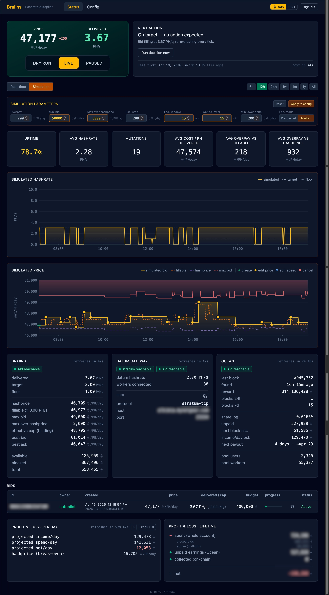

# Hashrate Autopilot

A personal-scale autopilot and monitor for the [Braiins Hashpower marketplace](https://hashpower.braiins.com/).
Keeps your rented-hashrate orders continuously active and cost-optimized within a tolerance you control, so purchased
hashrate keeps landing at your own Datum-connected pool without manual babysitting.


The Status page is a single scroll: a hero card with the live bid price, delivered hashrate, and the DRY-RUN /
LIVE / PAUSED switch on the left; the Next Action panel on the right explaining what the autopilot is about to do
and when. Below that sit range-selectable hashrate and price charts overlayed with bid events, a stats strip
(uptime, avg hashrate Braiins-vs-Datum, mutation count, cost per PH delivered, overpay vs fillable and vs hashprice),
service panels for Braiins / Datum Gateway / Ocean, the active bids table, and per-day and lifetime P&L.

## Why this exists

The Braiins Hashpower marketplace works well, but orders cancel overnight, prices move, and fills thrash when bids are
undersized. The common failure mode for a home miner is: wake up and discover that the order cancelled hours ago and
you've been sitting at zero hashrate since. This project replaces that with a controller that quietly holds a bid alive
at a price the operator is comfortable with, and escalates only when genuinely needed.

The goal is **bounded, observable downtime** with an explicit recovery policy, not gapless uptime.

## Scope

**v1 (current):** Braiins Hashpower marketplace only. Single operator. Single always-on host on a home LAN alongside an
Umbrel Bitcoin node running [Ocean](https://ocean.xyz/) with a Datum Gateway.

**v2 (aspirational):** Multi-market abstraction so additional hashrate marketplaces can be plugged in behind the same
controller and dashboard.

Non-goals (v1): SaaS / multi-user, cloud deployment, hands-free wallet funding, gapless uptime.

## How it works

- A Node daemon runs a periodic control loop (default 60 s): reads Braiins marketplace state, compares it against the
  operator's configured targets, and decides whether to create, edit, or cancel bids.
- **All three actions are fully autonomous.** An owner-scope API token authorises `POST /spot/bid` and `PUT /spot/bid`
  directly — the 2FA prompt that appears in Braiins' web UI does *not* gate the API path. The autopilot therefore has a
  single mutation gate (DRY-RUN vs LIVE vs PAUSED) rather than a separate human-in-the-loop confirmation layer.
- A React dashboard binds to the LAN, shows current state, live decisions, charts, and operator overrides.
- State and tick metrics persist to SQLite and survive restarts. Boot mode is configurable: always dry-run (default),
  resume last mode, or always live. Old `tick_metrics` and uneventful `decisions` rows are pruned hourly per
  configurable retention windows.
- Each tick also polls the **Ocean pool API** (hashprice, pool stats, payout estimate, recent blocks) and — when a
  `datum_api_url` is configured — the **Datum Gateway's `/umbrel-api`** for a second hashrate reading measured at the
  gateway. Both integrations are informational; the control loop never depends on them being reachable.
- Optionally reads `bitcoind` or Electrs for on-chain payout observation (income tracking, runway calculation).

Full design: [`docs/spec.md`](docs/spec.md) · [`docs/architecture.md`](docs/architecture.md) ·
[`docs/research.md`](docs/research.md).

## Key features

- **Depth-aware pricing** — walks the order book to find the cheapest ask that can actually fill your target capacity,
  not just the top-of-book price.
- **Escalation ladder** — when hashrate drops below your configured floor, the autopilot raises the bid in steps (or
  jumps, selectable) up to your max, then holds. Lowers again when the market softens, with a configurable
  patience window (`lower_patience_minutes`) to avoid chasing transient dips that reverse before the Braiins 10-min
  price-decrease cooldown expires.
- **Two-layer price ceiling** — a fixed `max_bid_sat_per_eh_day` plus an optional dynamic cap
  `max_overpay_vs_hashprice_sat_per_eh_day`. When both are set the effective cap per tick is the lower of the two —
  stops the autopilot overpaying when hashprice crashes but the fixed max still allows it.
- **Cheap-mode scaling** — when the market price drops below a threshold relative to hashprice (break-even), the
  autopilot can automatically scale up to a higher target to capture cheap capacity.
- **Ocean pool integration** — reads hashprice, pool earnings, time-to-payout, and recent blocks (including ones found
  by your own share stream) from the Ocean API. Hashprice is plotted historically on the price chart; blocks that
  Ocean flags as found by this payout address appear as gold markers on the hashrate chart.
- **Datum Gateway integration (optional)** — when `datum_api_url` is configured, the daemon polls Datum's
  `/umbrel-api` each tick and records the gateway-measured hashrate alongside the Braiins-reported number. A
  sustained gap means Braiins is billing for hashrate the gateway never saw. See
  [`docs/setup-datum-api.md`](docs/setup-datum-api.md) — on Umbrel the API port is not exposed by default and needs a
  one-line compose edit plus a full OS reboot (tested and stable since 2026-04-19).
- **What-if simulator** — replays historical `tick_metrics` against a candidate set of strategy parameters and shows
  the simulated uptime, cost, P&L, and tick-by-tick price trace overlaid on the live charts. Lets you backtest a new
  max-bid / overpay / patience setting against real recent market conditions before committing to it.

  

  Flip the Real-time / Simulation toggle at the top of the Status page and the charts redraw against a synthetic
  bid trace computed from the current parameter bar — Overpay, Max bid, Max over hashprice, Esc. step, Esc. window,
  Wait to lower, Min lower delta, and dampened-vs-market escalation mode. Stats recalculate in place (uptime,
  mutation count, avg cost, avg overpay), the simulated cap line and excluded zone follow the sim `Max bid` so you
  can see whether your ceiling would have clipped real escalations, and the "Apply to config" button writes the
  validated set back to the live daemon once you're happy.
- **Dashboard** — hashrate and price charts with time-range picker, bid event markers, pinned-tooltip JSON export,
  stats bar (uptime, avg hashrate — Braiins and Datum side-by-side when Datum is on, cost metrics, mutation count),
  split P&L panels (period and lifetime), live bid table with full IDs, and a full config editor with live reload.
- **BTC/USD denomination toggle** — all prices and balances can be viewed in sats or USD using a live BTC price oracle
  (CoinGecko, Coinbase, Bitstamp, or Kraken).
- **Operator overrides** — bump price, trigger an immediate decision tick (bypasses the patience window for one
  tick), pause/resume, or switch between dry-run and live from the dashboard.

## Configuration

Everything that influences the controller — hashrate targets, pricing caps, escalation strategy, budget and alert
timers, boot mode, payout-source backend, retention windows, the optional Datum and Ocean endpoints — is
live-editable from the Config page. Values are validated against the same Zod schema the daemon uses at startup;
Save writes the new row and the next tick picks it up. No daemon restart needed for any value on this page.


Sections map directly to the spec: **Hashrate targets** (including the cheap-mode scale-up), **Pool destination**
(pool URL, worker identity, Datum stats API URL), **Pricing caps** (fixed `max_bid` plus the optional dynamic
`max_overpay_vs_hashprice`), **Fill strategy** (overpay, min lower delta, escalation mode + step + window, wait
before lowering), **Budget**, **Alerts & timers**, **Daemon startup** (boot mode — always dry-run / resume last /
always live), **On-chain payouts** (payout address + Electrs-or-bitcoind backend), **Profit & Loss** spend scope,
**BTC price oracle** (feeds the sat↔USD toggle), and **Log retention** for the append-only `tick_metrics` and
`decisions` tables.

## Tech stack

TypeScript monorepo (pnpm workspaces), Node 22+, React dashboard, SQLite (better-sqlite3), sops-encrypted secrets.

```
packages/
├── braiins-client   # typed client for the Braiins Hashpower REST API
├── bitcoind-client  # minimal bitcoind RPC client for on-chain payout observation
├── daemon           # control loop, gate, ledger, HTTP API, persistence
├── dashboard        # React UI (LAN-only)
└── shared           # shared types and utilities
```

## Prerequisites

- Node.js 22+ and `pnpm` 10+ (install commands below — neither is in Ubuntu's default apt repos at the right version)
- A Braiins account with API tokens (one **owner** token, and optionally a read-only token)
- An Ocean pool account with a Datum Gateway running locally (stratum port 23334), and a BTC payout address
  configured as the worker identity (`<btc-address>.<worker-label>` — Ocean credits shares by address, not by label)
- *(Optional but recommended)* The Datum Gateway HTTP API exposed on your LAN for the dashboard's second-source
  hashrate panel. On Umbrel this is a one-line `docker-compose.yml` edit plus a full OS reboot —
  see [`docs/setup-datum-api.md`](docs/setup-datum-api.md) for the verified recipe and the landmines to avoid
  (do **not** use `umbreld apps.restart.mutate` — it wedged the Umbrel box on our first live attempt; the dashboard
  Restart button or a cold-boot is fine and has run uninterrupted since).
- `sops` + `age` for encrypted secrets (API tokens, optional bitcoind credentials)
- *(Optional)* A running `bitcoind` or Electrs endpoint for on-chain payout tracking

### Installing Node + pnpm

On **Ubuntu / Debian** (tested on Ubuntu 22.04 and Raspberry Pi OS) the default apt `nodejs` is too old and
`pnpm` isn't packaged at all. Grab Node 22 from NodeSource, then use `corepack` (bundled with Node) to
activate `pnpm`:

```bash
# Node 22 via NodeSource
curl -fsSL https://deb.nodesource.com/setup_22.x | sudo -E bash -
sudo apt install -y nodejs

# pnpm via corepack (no separate install needed)
sudo corepack enable
corepack prepare pnpm@latest --activate
```

Verify with `node -v` (≥ v22) and `pnpm -v` (≥ 10).

On **macOS** (Homebrew):

```bash
brew install node pnpm
```

### Installing sops + age

Required before `pnpm setup` — it shells out to both.

On **Ubuntu / Debian**:

```bash
sudo apt install -y age

# sops isn't in apt. Releases are version-named, so resolve the latest tag
# from GitHub's /latest redirect, then download the matching .deb. On arm64
# (Raspberry Pi) replace `amd64` with `arm64`.
SOPS_VER=$(curl -fsSL -o /dev/null -w '%{url_effective}' https://github.com/getsops/sops/releases/latest | sed 's|.*/||')
curl -fsSL "https://github.com/getsops/sops/releases/download/${SOPS_VER}/sops_${SOPS_VER#v}_amd64.deb" -o /tmp/sops.deb
sudo apt install -y /tmp/sops.deb
sops --version
```

On **macOS**:

```bash
brew install age sops
```

## Getting started

```bash
git clone https://github.com/rdouma/hashrate-autopilot && cd hashrate-autopilot
pnpm install
pnpm build
pnpm setup
```

`pnpm setup` is the interactive first-run wizard — it generates an `age` key, writes the `sops` policy,
prompts for your Braiins tokens + core config, and initialises the SQLite database. Refuses to overwrite an
existing setup unless you pass `--force`. (Install `age` and `sops` first — see prerequisites above.)

Then start the daemon:

```bash
pnpm --filter @braiins-hashrate/daemon start
```

The dashboard is served at `http://<host>:3010`. On first launch the daemon boots in DRY-RUN mode — promote to LIVE
from the dashboard when ready. Remaining configuration (target hashrate, caps, payout source, etc.) is editable
from the dashboard's Config page.

### Manually editing secrets later

`pnpm setup` covers the initial secrets file. If you need to re-edit it (rotate a token, add bitcoind
credentials, etc.), open it with `sops`:

```bash
SOPS_AGE_KEY_FILE=~/.config/braiins-hashrate/age.key sops .env.sops.yaml
```

The explicit `SOPS_AGE_KEY_FILE` is only needed if you don't have the key at the default sops location
(`~/.config/sops/age/keys.txt`) — `pnpm setup` writes it to `~/.config/braiins-hashrate/age.key` by design, so
this project's key stays separate from any other sops-encrypted project on the same host.

### Running on a second host (or migrating)

`.env.sops.yaml` is checked into git and safe to clone, but the matching **age private key is not** — that's
the whole point of sops. If you re-clone on a new host and run `sops .env.sops.yaml` without the key present,
you'll see:

```
Failed to get the data key required to decrypt the SOPS file.
Group 0: FAILED
  <public-key>: FAILED
    - failed to load age identities: failed to open file: open
      /home/<user>/.config/sops/age/keys.txt: no such file or directory
```

Fix: copy the age private key from the original host to the new one at
`~/.config/braiins-hashrate/age.key` (or the default `~/.config/sops/age/keys.txt`). `chmod 600` it. If you
prefer a clean start instead, you can re-run `pnpm setup --force` to generate a fresh key — but you'll need to
re-encrypt `.env.sops.yaml` against the new key (or let `pnpm setup` rewrite it from your re-entered values).

See [`docs/spec.md`](docs/spec.md) for the full design and [`docs/architecture.md`](docs/architecture.md) for
deployment details.

## Updating a running deployment

`scripts/deploy.sh` is the one-shot updater for a machine that already has the repo checked out and the daemon
running. It pulls `main`, reinstalls pinned deps, builds, runs the tests, and only then restarts the daemon —
so a broken commit won't take your running autopilot down with it.

```bash
./scripts/deploy.sh
```

Safe to run while the daemon is live; the restart happens after the build + tests succeed. No state loss —
`data/state.db` is untouched and the floor / patience timers are persisted across restarts.

Common patterns:

- **Manual update** after you see a new release or commit you want: just run it.
- **Nightly cron** (fully hands-off): `0 4 * * * cd /path/to/hashrate-autopilot && ./scripts/deploy.sh >> ~/deploy.log 2>&1`

The script does a `git pull --ff-only` internally, so it only runs on a tracking branch (e.g. `main`). If you'd
rather pin to a tagged release, manage the checkout manually (`git fetch --tags && git checkout v1.0.1 && pnpm
install && pnpm build && ./scripts/restart.sh`) — deploy.sh will fail on a detached HEAD, which is safer than
silently moving you off the pin.

## Disclaimer

This is an independent, unofficial project. **Not affiliated with, endorsed by, or supported by Braiins Systems s.r.o.**
"Braiins" and "Braiins Hashpower" are trademarks of their respective owners and are used here only to identify the
marketplace this tool interacts with.

Using this software to automate real trades involves real money and real counterparties. You are responsible for your
own funds, your own API keys, and the legal status of hashrate trading in your jurisdiction.

## License

MIT — see [`LICENSE`](LICENSE).